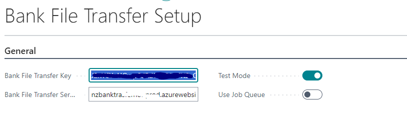
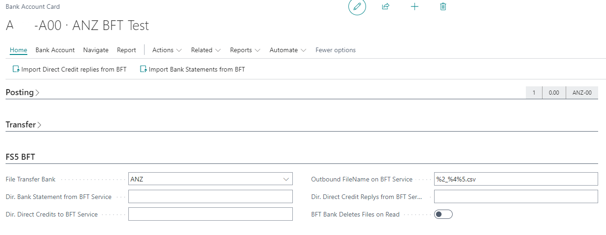
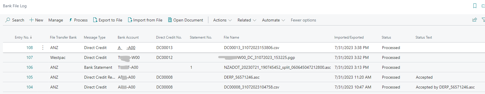

# Bank File Transfer

## Overview

Transfer files to NZ Banks directly through an Azure Function connecting to the Banks SFtp and PGP file encryption. 

a Connector Extension for __Fusion5 Direct Credit (EFT)__ exists.

## Azure Function App Setup

[Bank File Transfer App Manual](img/Bank%20File%20Transfer%20Function%20App.docx) (.docx download)

## Bank File Transfer Setup

use this to setup access key and url of your Bank File Transfer Azure function App.

__Test Mode__ will enable a __LOT__ of confirmation messages and will disable any automatic deletions of files at the corresponding SFTP site.
__Use Job Queue__ will move all __SENDING__ tasks to a generated Job Queue Entry _use this to decouple slow DC sending from the user experience; generally not required_

### Additional Bank Account details for Bank File Transfer

Additional details need to be added to the Bank Accounts integrated through the Bank File Transfer.

__File Transfer Bank__ this will need to be set for __ALL__ bank accounts being serviced by BFT files imported from the Bank.

__Dir. Direct Credits to BFT Service__ this is needed if Direct Credit files are exported for this account

__Outbound Filename on BFT Service__ this is needed if Direct Credit files are exported for this account. Filename for the exported Direct Credit Files. %1 = Bank Account, %2 = Direct Credit No., %3 =Bank Account No. ,%4 = Date Stamp (DDMMYYYY), %5 = Time Stamp (HHMMSS)

__Dir. Direct Credit Replies from BFT Service__ this is only needed if there is a specific folder at the Banks SFTP for every Account; otherwise the files imported from the same folder can be done from a single Bank Account. The actual File Bank Account will be updated based on the file name/content evaluation rules implemented for the Bank.
_the "Message Type" will be reevaluated as well in case Bank Statements and Direct Credit replies are processed through the same folder at the Bank_

__Dir. Bank Statement from BFT Service__ this is only needed if there is a specific folder at the Banks SFTP for every Account; otherwise the files imported from the same folder can be done from a single Bank Account. The actual File Bank Account will be updated based on the file name/content evaluation rules implemented for the Bank.
_the "Message Type" will be reevaluated as well in case Bank Statements and Direct Credit replies are processed through the same folder at the Bank_

__BFT Bank Deletes Files on Read__ flag if a Bank is setup to automatically delete a file on reading _ANZ does this; it should work regardless but you avoid unnecessary BFT service REST calls and error catching events_

## Bank File Log

Displays all incoming and outgoing files.
"BFT Bank" assigns the processing logic and evaluation of the "Message Type" and "Bank Account" for incoming files based on "File Name" and "File Content" depending on Bank.
"Message Type" indicates direction for outgoing files ("Direct Credit"). 

### Page Action
 - __Process__ (re)process a Bank File
 - __Export to File__ Export the imported file _split files will export the split content_
 - __Import from File__ imports and processes a file _a BFT Bank dialog might be displayed if Bank Accounts for different BFT Banks are setup_
 - __Open Document__ will open your Bank Statement or related BC page _a integration point exists enabling opening Fusion DC Cards_
 - __Actions__
    1. __Set Manually Processed__ use this to mark a Lo0g entry as processed that needed a manual work around
 - __Related__
    1. __Show Error__ displays the full _Status Text_ for easier readability
    2. __Show Content__ displays the file Content as message _future update to rich-text editor planned_

## Bank Side Setup Notes

 - Bank needs to provide separate folders for Statements and DC replies for EACH Company in BC
 - ALL files need to have a file ending .*** of some sort *Example: DERP_58572102.asc*
 - ANZ Bank Statements are to be split by Bank Account and the Account No. is to be provided in the last "_" separated grouping before the file ending in the file name *Example: NZADOT_07032024_split_012345678900200.asc*
