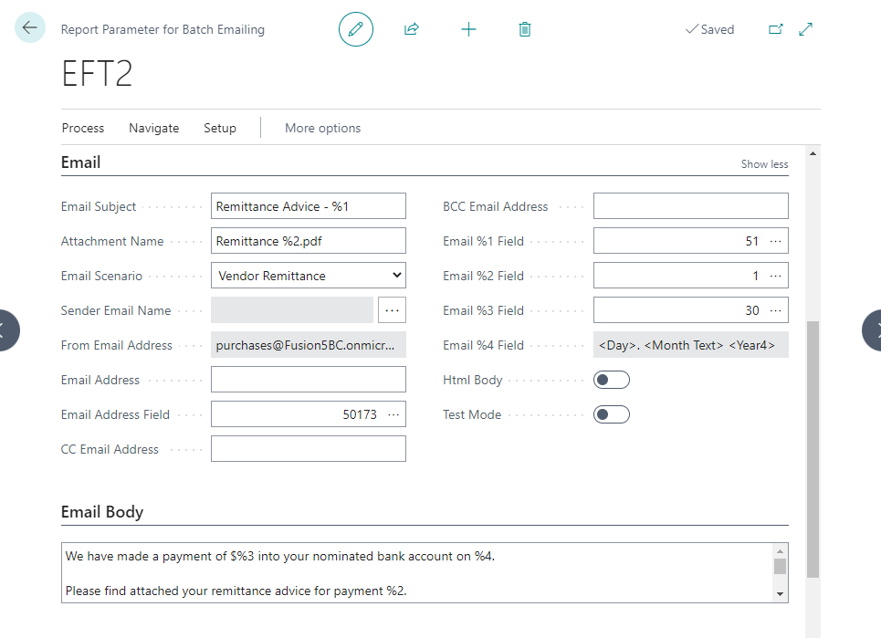
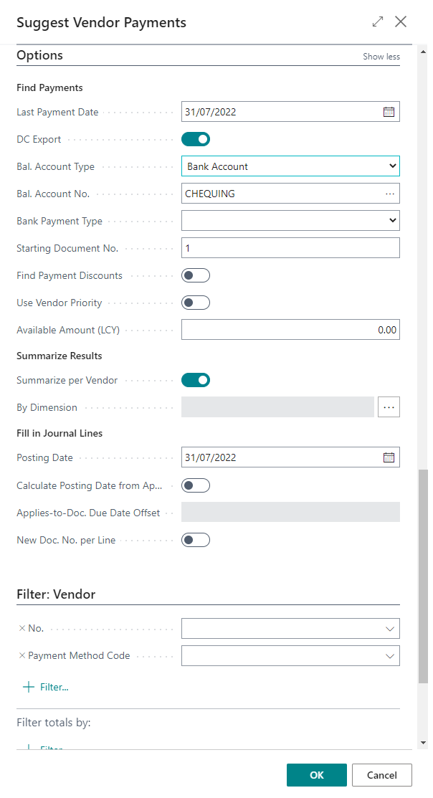

# <span className="fusion5-text">Manual</span>

## Overview

The Electronic Funds Transfer (EFT) module allows purchase and payments
journals to be output in an electronic format.

Formats are provided for the major New Zealand banks and can be
customised for other banks as required. Note: These customisations do
not come as part of the EFT Add-On.

Bank Account Setup
==================

Some specific configuration/setup is required on the Bank Account card
before the EFT module can process correctly.

-   Go to **Cash Management - Bank Accounts**

-   Select the required **Bank Account** from which you wish to allow
    EFT processing.


In the Advanced Direct Credit Fast Tab enter data into the following
fields:

-   **DC Format** **ID**-- this is a look-up to the bank export formats
    that have been written and are available for use -- select the
    correct one for your banking system e.g. 50174 is for BNZ in csv
    format.

-   **DC Number Series** -- this is a standard DC number series to be
    used when you generate a Direct Credit run -- the number series must
    be set to allow "Default Nos".

-   **DC Payer Name** -- this is a specific requirement for one of the
    bank formats.

-   **DC Remittance Footer 1 -- 3** --Enter details here that you wish
    to see at the bottom of all remittance advices. You can enter a
    substitution text %1 and this will enter the bank account number of
    the vendor.

- Note: You can enter this in any of the footer lines. Up to 250
- characters are allowed in each footer line.

-   **HSBCnet DC Account No.** -- this is a specific requirement for
    HSBC.

-   **Remittance Email Sender Address** -- this is the Email address
    that remittances will be sent from.

- **Note:** This Email address must be setup as an alias under Email
- Accounts. There will be a section following that talks more about
- Email Accounts, in particular Shared Mailboxes.

Dimensions
----------

- **Note:** some organisations will require Dimensions for Balance Sheet
- Accounts, which means that the Bank Account may require Dimensions
- against it.

-   From the **Bank Account Card** click on **Bank Account -
    Dimensions**


Vendor Bank Account Setup
=========================

A vendor can have multiple Bank Accounts, each of which can be setup
with direct credit details. Only one Bank Account may be selected as the
default for Direct Credit payments.

Vendor Bank Accounts are found within standard BC Vendor Card setup, and
it is mandatory that you fill in the Bank Branch No. and Bank Account
No. fields.

-   Go to **Vendors and** select the required vendor

-   Click on **Navigate** - **Bank Accounts**


-   Click **+ New** to create a new Bank Account Card.


-   Enter Bank Details:

```
-   Code

-   Name

-   Bank Branch No.

-   Bank Account No.
```


-   Go back to the Vendor Bank Account List.


-   Go back to the Vendor Card, and expand the **Payments Fast Tab**.

-   In the **DC Bank Account** field, select the appropriate bank
    account from the drop-down list.

This will be the default Bank Account used for Direct Credit payments.


-   **DC Bank Account** -- this is the default Vendor Bank Account code
    that will be used for generating a Direct Credit payment for this
    vendor.

-   **EFT Reference, EFT Analysis Code & EFT Particulars** -- these will
    appear on the Direct Credit line when generated and will be included
    in the file for the bank. This will also be displayed on the Vendor
    Bank statements.

    If you wish to include the invoice number of the first invoice being
    paid in one of these three EFT fields, you can enter _inv_ into the
    field (see EFT Reference in the above example). This is not case
    sensitive so _INV_ or _inv_ will both work.

Direct Credit Setup
===================

Default Bank Statement References
---------------------------------

-   Search for and go to **Direct Credit Setup**.

This is where you can set default values for the Bank Statement
reference fields.


These default values will get used if the Vendor Card does not have
these fields populated.

The Remittance Advice Report No. field is for the Report ID of the
report being used. This should match the report ID in the Report
Parameters for Batch Emailing.

You can also find the Report ID by going to:

-   **Report Layout Selection** - Search: DC Remittance Advice


Bank Account Validation
-----------------------

You have an option to enable **DC Bank Account Validation**. This is a
simple validation check that just checks the format of the Bank Account:

-   Branch = 2 digits

-   Bank = 4 digits

-   Account = 7 digits

-   Suffix = 2/3 digits

Email Accounts
==============

In BC, you need to set up Email Accounts for email addresses that will
be used for sending emails from BC. You can use multiple email addresses
when sending, for example:

-   __accounts@domain.com__ -- for internal approval email notifications

-   __payables@domain.com__ -- for sending remittances to vendors

-   __receivables@domain.com__ -- for sending invoices, credit notes and
    statements to customers

Email Accounts can be setup for Shared Mailboxes, current user and SMTP
sending.

We need to assign scenarios to each Email Account.

Creating a new Email Account
----------------------------

-   Search for **Email Accounts**

-   Click **New** and work through the assisted setup screen


Assigning Scenarios
-------------------

-   Select the Email Account you want to assign scenarios to

-   Click on **Navigate - Email Scenarios**


-   Click **Assign Scenarios**


Important -- Shared Mailbox Permissions
---------------------------------------

In order to be able to send emails from BC using a shared mailbox,
individual users will need to have Send as or Send on-behalf permissions
to the shared mailbox.

If your organisation has granted Fusion5 admin access to your Email
Exchange, we will be able to assist you. Otherwise, you will need to
contact your IT department to ensure users who will send emails have
this permission.

Report Parameters for Batch Emailing Setup
==========================================

-   Search for and go to **Report Parameters for Batch Emailing**

-   You can either create a new setup **(+ New**) or create the default
    setups for all types of documents that you may want to send as a
    batch process.

    Click on **Actions - New Document - Create Defaults**


General
-------


If you are sending emails by batch, the Remittance default may already
have been created.

-   **Code**: i.e. EFT, DC, REMIT, etc.

-   **Report ID**: 50171

-   **Use for Document**: Enabled

-   **Batch Table ID**: 23

-   **Report Table ID**: 50171

-   **Batch Link Field No**: 50

Email
-----



-   **Email Subject**: The Subject Line you want to appear in your
    Remittance emails

-   **Attachment Name**: The file name for your remittance attachments

-   **Email Scenario**: Vendor Remittance

-   **From Email Address**: Automatically populated based on the Email
    Scenario

-   **Email Address**: Fill this in when running Test Mode -- all batch
    emails will be sent to the email address defined here

-   **Email Address Field**: 50173 (EFT Remittance Email Address from
    Vendor Card)

-   **Email %1 - %3**: Placeholders for Lookup Fields

    -   51 = Vendor Name (Source Name)

    -   1 = Direct Credit No

    -   30 = Amount (LCY)

Suggest Vendor Payments (DC)
============================

This function resides within Payment Journals and identifies Vendor
invoice payments that are due and not yet paid.

-   Go to **Cash Management - Payment Journals**

-   Create a Payment Journal Batch for DC Payments


-   **Name**: User definable name

-   **Description**: User definable description

-   **Bal. Account Type**: Bank Account

-   **Bal. Account No.**: Bank Account from which you wish the payments
    to be made

-   **No. Series:** Must be Blank

On the ribbon click on **Prepare - Suggest Vendor Payments**

If you cannot see the Suggest Vendor Payments button, you may need to
customise your ribbon to add this.




Ensure that:

-   **DC Export:** is true

-   **Bal Account Type:** is Bank Account

-   **Bal Account No**: is set to the account from which you wish the
    payments to be made

-   **Bank Payment Type:** is blank

-   **Starting Document No**.: is not blank - i.e. needs a value

-   Under **Filter: Vendor**: you can choose to have a Payment Method
    Code if your Vendors have been setup this way - i.e. all the Vendors
    you pay by Direct Credit have a payment method = DC.

Note that this function is similar to the standard BC Suggest Vendor
Payments routine. But because you have identified it as a DC Export this
means that only payment journal lines where the vendor contains a DC
Bank Account Code will be identified for payment. All other filtering
and options are as per the standard functionality.

Note **Applies-To Doc. No.** indicates which invoices are applied to
this payment.

Select the line you want to see invoice details for and then click on
the elipses \[...\]

Once the Suggest Vendor Payments process is completed, you can generate
the Direct Credit Card.


Direct Credit Card
==================

The **Direct Credit Card** is a preparatory view of the Direct Credit
(EFT) file that will be generated.

-   From the **Payment Journal** click on **Process** - **Generate
    Direct Credit.**


This **Direct Credit Card** contains all the information from the
Payment Journal and also the Bank Account / reference details from the
vendor(s) identified for payment.

At this stage of the process, only the DC Reference, DC Analysis Code &
DC Particulars can be changed. Note in the example below, the DC
Reference field contains the vendor invoice number INV121212 because we
had entered _INV_ in the EFT reference field on the Vendor Card.

From here the following actions can be applied to the Direct Credit
card.


These options are under the **Direct Credit** menu.


-   **Cancel** -- this step is optional and is used only when the
    Payment Journal lines must be changed / deleted. Select **Cancel**
    from the ribbon, and then make changes to the original journal lines
    as required.

-   **Export** -- creates the Direct Credit output file and updates the
    status of the Direct Credit Card from blank to "Exported". When you
    export the file, the system creates a file with the Direct Credit
    Document No. For most browsers, the file will download
    automatically, and you will find it in your Downloads folder or as
    per your personalised browser setup.


-   This file is for your bank to process and make the physical
    payments. Your internal business process will dictate how this file
    is provided to your bank.


-   **Print Remittance Advice** -- Although this is the order of actions
    applied, this action can *only be completed after the payment
    journal is posted* (in the next section). You will get a warning
    message if you try to print before the post:


Payment Journal
===============

The next stage is to post the Payment Journal for the Direct Credit
Payments.

Note that an EFT Batch must **not** have a "No. Series" set up.
Otherwise, the journal will not post.

-   Go to **Financial Management - Payables - (Tasks) Payment
    Journals**

-   Select **Post or Post and Print** to post the journal


Producing the Remittance Advice
===============================

Email Remittances from the Advanced EFT
---------------------------------------

Once the Payment Journal has been posted, you can email the Remittance
Advice.

-   Go to **Direct Credit List**

-   Select the **No**. (Export Document Number) to open the record

-   Click on **Direct Credit - Email Remittance Advice (all lines)**


Select **Email Remittance Advice.** (individual lines)

-   Select the documents you want to email

-   Click on **Manage - Email Remittance Advice**


Emailing a Remittance Advice from the Vendor Ledger Entries screen
------------------------------------------------------------------

To print an individual **Remittance Advice** from the Vendor Ledger
Entries, highlight the required **Payment** line.

The payment must have been made through the Fusion5 **EFT Add-On.**

The **Email Report** Fast Tab on the Vendor Card must have an active
email address set up for the **EFT Report Type**.


Printing Remittances
--------------------

If you normally print your Remittance Advices rather than emailing them,
then following the successful Payment Batch posting, you can return to
the Direct Credit Card and select **Print Remittance Advice** from the
Ribbon.

-   Go to **Direct Credit List** and select the Direct Credit No. you
    wish to print

-   Click on the **Print Remittance Advice** button from the Ribbon

-   Make sure the **No. Printed** is blank


The **Remittance Advice** will look something like this:


Now the EFT process is complete:

-   Direct Credit payments due have been identified and this information
    has provided to the bank for payment.

-   Payment journals for the DC banking transactions have been
    completed.

-   Remittance Advices have been created -- these should now have been
    sent to the vendors via email or through the post.

Bank Account Audit Log
======================

Change Log Setup
----------------

-   Go to **Change Log Setup**

-   Select **Change Log Activated**

-   Click on **Setup - Tables**

-   Find **Table 288** (Vendor Bank Account) and select **All Fields**
    for Insertion, Modification and Deletion


Running Audit Log
-----------------

-   Go to **Payment Journal**

-   Open any **Journal Batch** (Assumption is you would run this prior
    to creating your DC Batch to confirm whether which Vendors Bank
    Accounts have been modified since the last payment run)

-   Select **Vendor Bank Account Change Log**


-   Select the required **Start and End Dates**

-   Select required **Output Option** for the report to **Send
    to...Print or Preview**


Vendor Bank Account Approvals
=============================

The Fusion5 EFT module also has a workflow for **Vendor Bank Account
Approvals**.

This workflow allows users to enter a proposed Bank Account
(xx-xxxx-xxxxxxx-xx) then an approval request is sent to a designated
approver and the Vendor is placed on hold until the Bank Account is
approved.

NOTE: The **Approval User Setup** needs to be completed before workflow
is enabled.

-   Search for **Workflows - Scroll to Purchases and Payables -**
    Select: **Fusion5 Direct Credit Extension -- Proposed Bank Account**


-   Select **Create an approval request for the record using approver
    type...** response


Select the first line under Response and set the options as follows:


-   **Approver Type**: Approver

-   **Approver Limit Type**: Specific Approver

-   **Approver ID**: User ID of the user who will approve proposed bank
    accounts

These are our recommended standard settings, but we can discuss
alternative options based on customer requirements where needed.

Return to the Workflow and enable the workflow.


