# Manual Advanced Dimensions

Advanced Dimension Management for BC

Deletion of unused Dimensions Values, automatic creation of Default Dimensions and creation of Linked Dimensions to other Dimensions Values.

## Delete unused Dimension Values

1. Search for Batch Delete Unused Dimension Values to find the Report under the Tasks headline.  

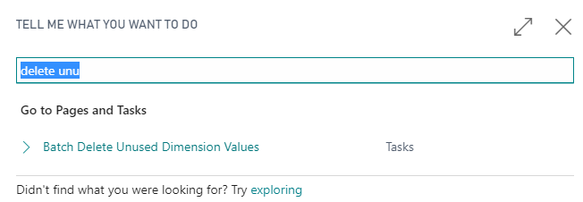

2. Run the Report and select the Dimension Code to clean up as required

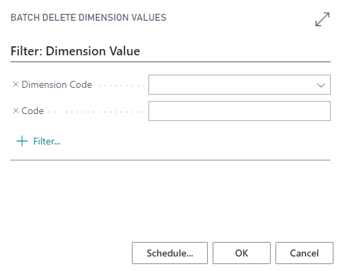

## Advanced Default Dimensions

1. Search for the Advanced Default Dimensions and edit existing *Advanced Default Dimensions* or create new (**+ New**)

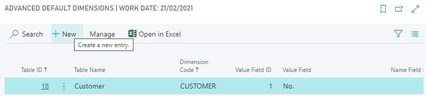

2. Use the field *Table ID* to select the Table for which to create Dimension Values. Here Table 18 *Customer*

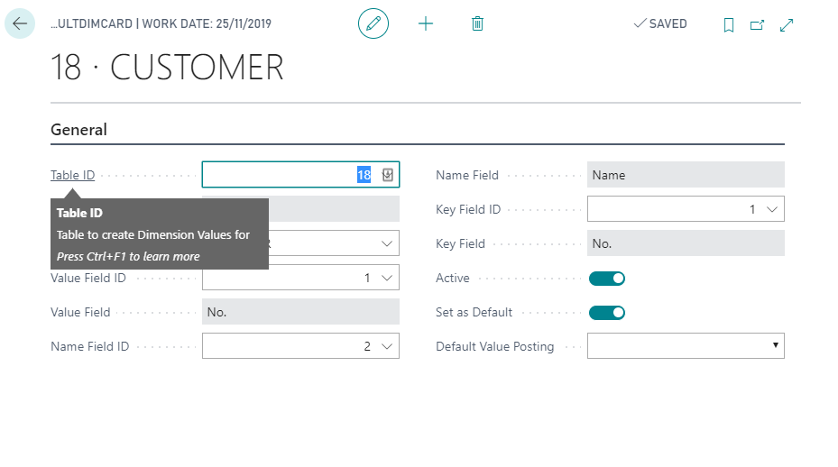

3. Use the field *Dimension Code* to select the  for which to create Dimension Values. Here we created a *Customer* Dimension

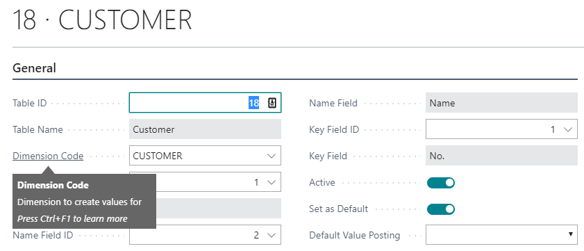

4. Use the *Value Field Id* to select the field the corresponding *Dimension Value* *Code* will be populated with. 

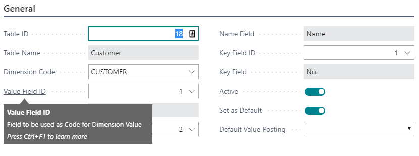

5. Use the field *Name Field Id* to select the  for which to create Dimension Values. Here we choose the *Name* field of the *Customer* Table.

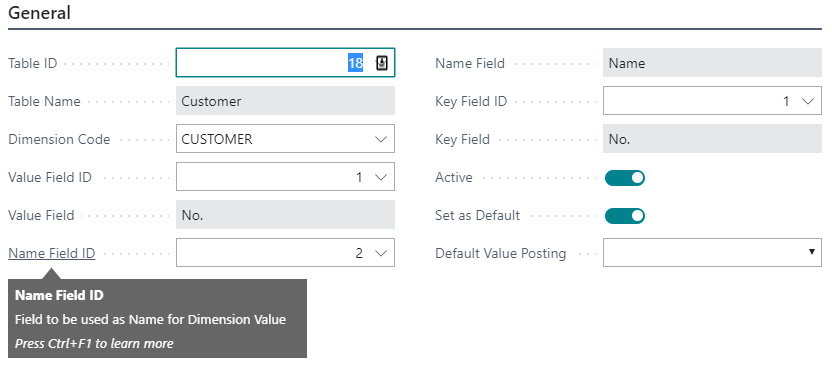

6. Use the field *Key Field Id* to specify the key field of the Table selected. This field will be automatically populated for you.

7. Use the field *Active* to activate the *Advanced Default Dimension* once all settings are satisfactory. 

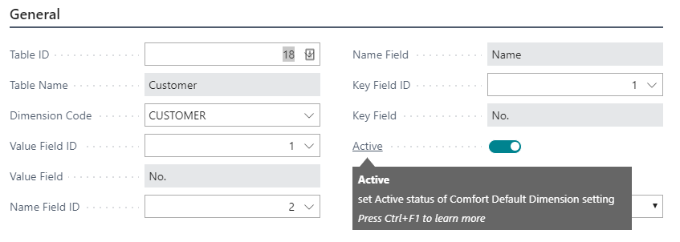

8. Use the field *Set as Default* to not only create the *Dimension Value* but set it automatically as *Default Dimension Value* for the corresponding record. 

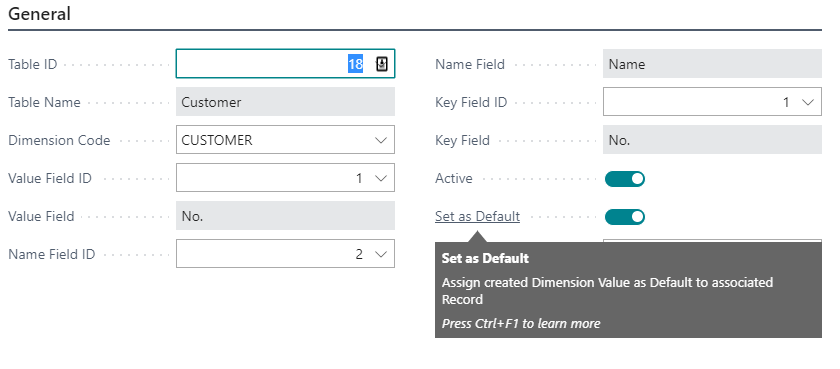

9. Use the field *Default Value Posting* to select the corresponding setting on the created or edited Dimension values. 

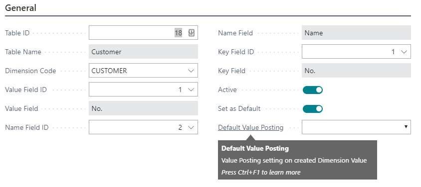

### Example (Advanced Default Dimensions)

Here an example of the resulting Default Dimension Value created after our example setup.

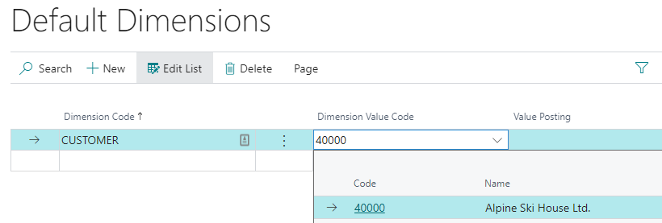

## Linked Dimension Values

1. From Dimension Setup (Search under Administration) 

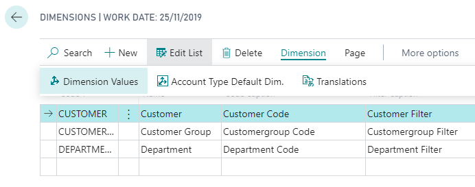

2. Select Dimension Value to link to

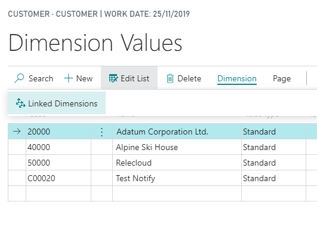

3. Select Linked Dimension Values to adjusted linked dimensions

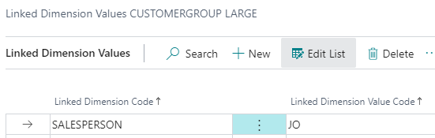

### Linked Dimension as new Dimension Value only

You can set the "New Value Only" flag to limit the creation to new dimension values as deafult only.
Not replacing existing Dimension values for the Dimension in question or reversing later manual adjustments.

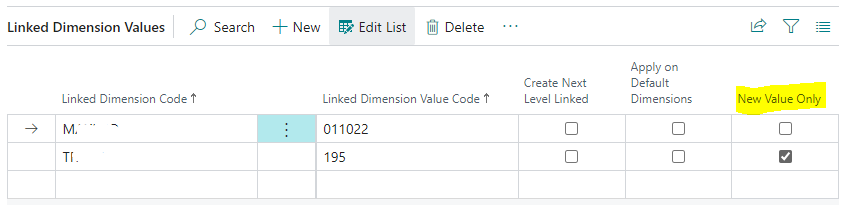

### Example (Linked Dimension Values)

Here an example of the resulting Dimension Value created after our example setup.

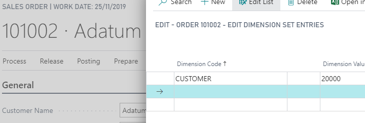
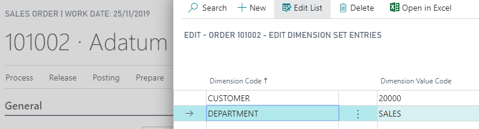

### Recursive Creation of Linked Dimensions on Linked Dimensions

You can create Linked Dimensions that have been setup based on Dimension created as a Linked Dimension.
To activate this tick the "Create Next Level Linked"

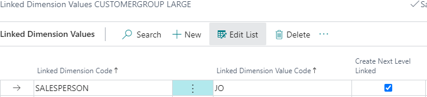

This will create all Dimensions Values Linked to the created linked Dimension value as well (example: SALESPERSON: JO).

__Note:__ This has only been enabled for up to 3 Levels deep; limted to avoid circular setup

You can navigate into the Linked Dimension Tree by using the page actions _Next Level Linked Dimensions_ and _Previous Level Linked Dimensions_

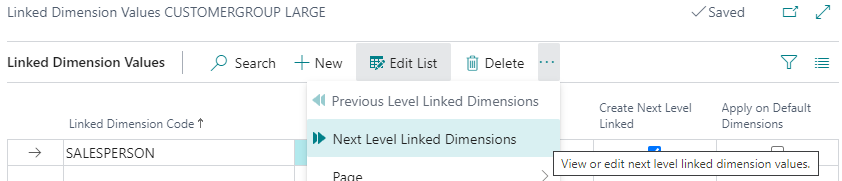

### Creating Default Dimensions from Linked Dimensions

Linked Dimensions are not replacing default Dimensions and will only be created for manually entered Dimnension Values.
To keep your settings consistent it is possible to create or update Default Dimensions from your Linked Dimension setups.

__Note:__ Table 167 Default Dimensions are treated differently and update Job Lines as well. Expect confirmation dialogs.

This can be enabled to be done automatically on the Linked Dimensions Page by setting the __Apply on Default Dimensions__ flag.
Alternatively this can be run from Search using the _Update Default Dimensions from Linked Dimensions_ functionality for a one of synchronisation.

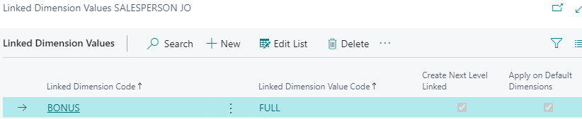

Deleting or deactivation of automatically created linked dimensions will result in the removal of all Default Dimensions created from the Linked Dimensions.

The Report for this 80111 "Update Default Dimensions from Linked Dimensions" can be setup on the Job Queue or run manually as well.
This batch process allows you to copy Linked Dimensions into Default Dimensions without enabling the automatic creation as well for an initial setup by enabling the flag to _Create all Linked Dimensions_; "Create Next Level Linked" rules are still applied.

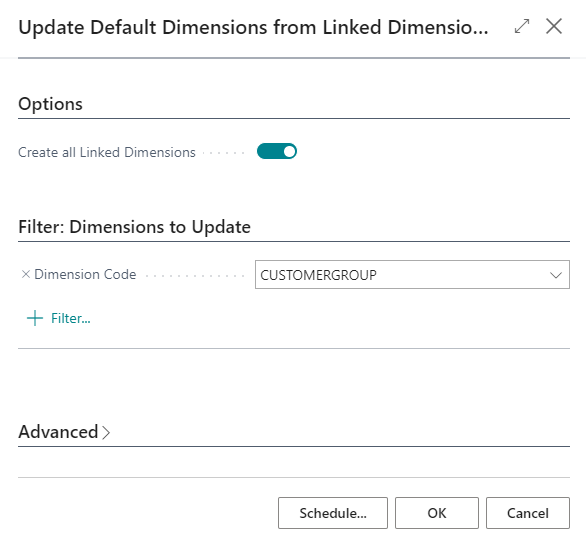

### Fix Dimension Set from Linked Dimension

Run from Search.

Fix Dimensions Sets associated with General Ledger Entries, Item Ledger Entries, Value Entries, Cust. Ledger Entries and Vendor Ledger Entries as well as 
Sales and Purchase Documents by creating additional Dimension Value Entries in the Set based on the Linked Dimensions Setup.

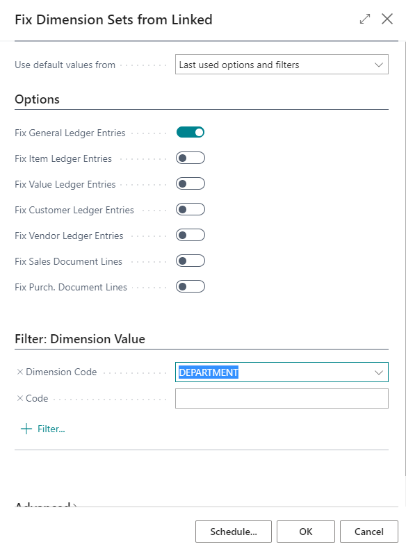

## Advanced Document Dimensions

Adjustment of the Document Dimensions craeted based on the Default Dimension setup for associated Values.

1. Search for the Advanced Document Dimensions and edit existing *Advanced Document Dimensions* or create new (**+ New**) 

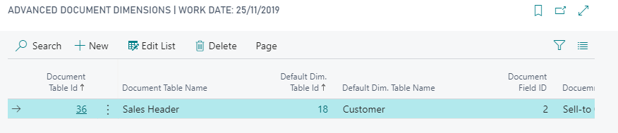

existing tables references in the standard rules will be replaced others will be added with up to 10 sources available for a document maximum including standard defulat dimensions sources.

### Example (Advanced Document Dimensions)

In this example the default Dimensions for a Sales Order will not be based on (standard Base App behavior):
 - from Customer Record defined in "Bill-to Customer No."
 - from "Salesperson/Purchaser" Record defined in "Salesperson Code",
 - from Campaign Record defined in "Campaign No.",
 - from "Responsibility Center" Record defined in "Responsibility Center",
 - from "Customer Template" Record defined in "Bill-to Customer Template Code"

Instead in this example the Default Dimensions for a Sales Order will be based on the Default Dimensions from the "Sell-to Customer No." instead of the "Bill-to Customer No.".

