# Manual Advanced Email

Fusion5 Extension for Emailling with Logs; Batch Emailing of Reports and Integrations between Fusion5 Extensions.

 - Different email addresses can be set for each document type. This can be done directly from each customer/vendor card.
 - Report Options can be set up for the Batch emailing of each document type. It is strongly recommended to set these up for every record (no filters need to be selected).
 - An Add. Attachment File can be uploaded for a subset of all receipients that will be included in the Email created by the Batch Report Parameter.

It is possible to create default setting from the List Page.

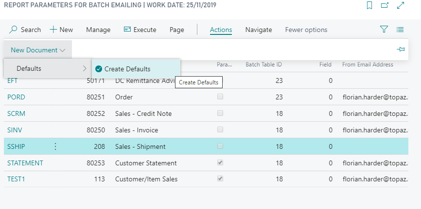

## Report Parameter Settings 

Email Report Parameters can be used for Batch and/or Document Emailing.

If required specify a report ID to run as attachment. 

To Print/send from the document the Parameters must be set to “Use for document” with the Report matching the Report selected for the document type, otherwise select "Run as Batch"

in the __Email__ section define sender address, and email details.

The % Fields allow for placeholder in texts for batch or document emailing; Decimal fields will be displayed based on local Currency Amount settings.

The Report Field will be used if no specific Email Address has been setup for that Batch Record.

If no non empty email address can be found no Email will be send.

Use "Test Mode" to exclusively send to the Email Address defined one the "Report Parameter" no "Report Emails", CC or BCC will be considered.

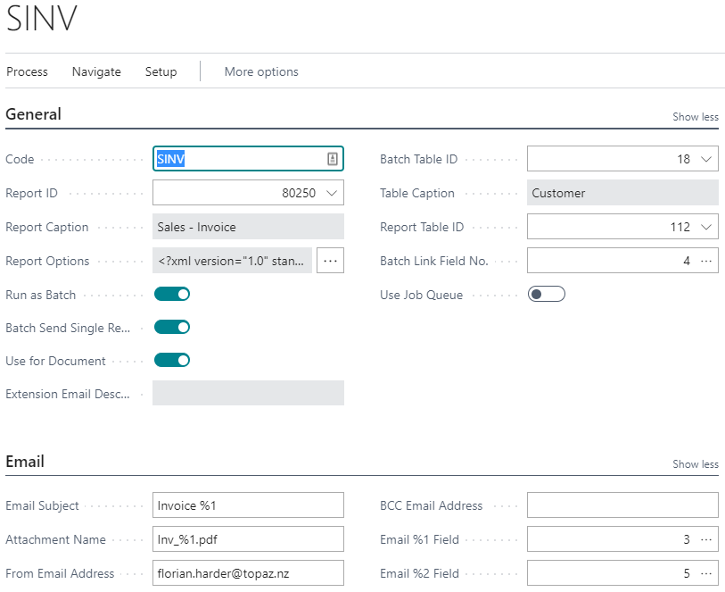

### for Batch Emailing

Batch Emailing is run from the Report Parameters Setup.
It is important to make sure all filters are set in the Report Parameters Options to avoid sending unnecesarry or unexpected Emails.

specify the _Report ID_ and for Batch Emailing (__Run as Batch__) the _Batch Table ID_ the Batch run will be based on.
If required specify the _Report Table ID_ as well, and the _Batch Link Field No._ with which to link the batch Record from the Report Record.

When the Batch run differs from the Report Detail Record you can send an email for every Batch Record __or__ for every Report Record.
The sending for every Report Record is set by setting _Batch Send Single Records_.

To limit the Batch run set a filter on the Report Options. The relevant Request Page will be displayed before each batch run for confirmation. 

Activate the "No Empty Report Error Log" flag to prevent the creation of Log Entries and Errors for Report Emails that have not been send when no Report Content was created with the specified filters for a Batch Record. Otherwise these will get logged with a _No Report Content_ error.

__IMPORTANT Developer Note__ for Batch emailing the Report Record DataItem has to be named after the Table Name only then the filters set on the Request Page can be found by the standard BC fuinctionality used (and logically as the request page only contains Name details).

### for Document Emailing

Document Emailing is executed when run from the Document Send actions including Post & Send for email outputs.

specify a Report Table Id and a Batch table Id and the Field with which to link the batch Record from the Report Record (will have to be a singular primary key like a Vendor or Customer No.)

The Report settings are picked up from the normal Document Emailing actions.

Saved Report Options filters will usually not be applied for Documents. __However__ you might need to setup empty Request Options to allow for Presetting of filters if used.

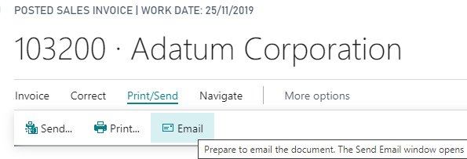

A Dialog for details will be shown before sending

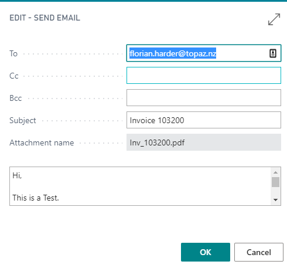

When Emailing a Statement from the Customer PageAction a Request Page dialog will be run first before the Email Dialog.

Standard Statement printing (& Emailing) actions will be replaced from Customer Cards and Lists based on the Batch Report Parameters. 

#### Documents with adjusted EMail/Send integration

Email Paramters for the Reports corresponding to the setup in the Report Selection need to be setup. 

 - Posted Sales Invoice - sending the selected document; no additional filters are applied.
 - Posted Sales Cr. Memo - sending the selected document; no additional filters are applied.
 - Posted Sales Shipment - sending the selected document; no additional filters are applied.
 - Sales Order Confirmation - sending the selected document; no additional filters are applied.
 - Sales Quote - sending the selected document; no additional filters are applied. 
 - Purchase Order - sending the selected document; no additional filters are applied.
 - Purchase Quote - sending the selected document; no additional filters are applied.
 - Customer Statement - saved Request Page Filters will be applied and a Request Page is shown, when run.

Additionally, Emails and Documents send from other Fusion5 Extensions are integrated when the Fusion5 Topaz Core is present.
For example:
 - Topaz EFT Remittance Advice - sending the selected document; no additional filters are applied.
 - Topaz Expense Management - sending Coding and Review Email notifications.
 - Topaz Direct Debit, Topaz Line Approvals etc...

## Report Parameter Page Actions

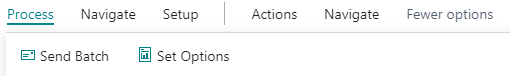

 - __Process > Set Options__ opens the Reports Request page to define filters; filters on the underlying Table will limit the Batch run.

 - __Process > Send Batch__ Run emailing process only for simple and batch Report emailing documents are run from the document. The Request for of the Report will be shown with the currently saved values for confirmation. 

 - __Process > Preview__ Preview the Report Attachment with a Request Page based on your stored filters.

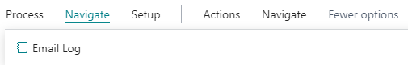

 - __Navigate > Email Log__ Log of Emails send for this Report

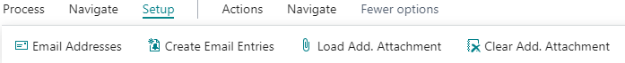

 - __Setup > Email Addresses__ Specify Email for Base tables record ids used in Batch and Document mailing

 - __Setup > Create Email Entries__ Creates Email address entries for all Record Ids

 - __Setup > Load Add. Attachment__ Runs a filter Report to select a set of Recipients (Batch Records) and opens a Dialog to upload an Add. Attachment file shared across all Recipients selected.

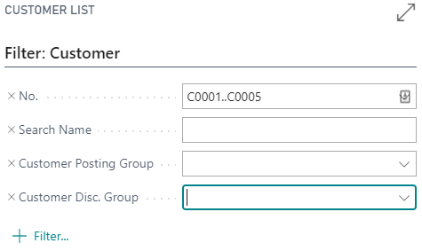

 - __Setup > Clear Add. Attachment__ Removes the Additional Attachment from the Recipient (Batch Records) selected in the filter Report.

## Batch Email Addresses 

Specific Email Addresses CC and BCC associated with a Batch Table Record. 

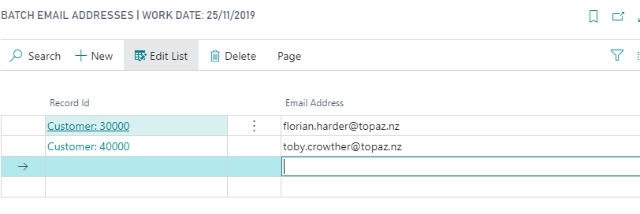

You can upload and clear Add. Attachments here as well for selected sets of Email Addresses. A good way to clear a specific Add. Attachment can be to filter the "Additional Attachment" field, select all records and clear the Add. Attachment.

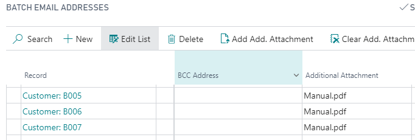

## Job Queue Setup

To regularly run a Batch emailing run create a Job Queue entry to run Codeunit 80200 "Email Report Topaz" with the Report Batch Parameter Code as "Parameter String". It is not recommended to use the "use Job Queue" setting for Report parameters run like this.

## Sending Emails using a Job Queue Entry

You can set the Report Parameter to __Use Job Queue__ which means to send Emails using a run once Job Queue entry that will send your email preventing any wait time and success feedback on the emailing process or trigger. 
__Maximum Job Queue Attempts to Run__ will define how often the Job Queue is attempting to resend. Delays for resends are between 1 and 5 Minutes; This can be used  to circumvent sending limits on the Mail Server.

## Email Log

Logs Emails send via the Topaz Extensions with Error logging and resending options. You can here preview PDF attachments and the E-Mail body.

Navigate from report parameter card > Email Log for each report or access directly from search.

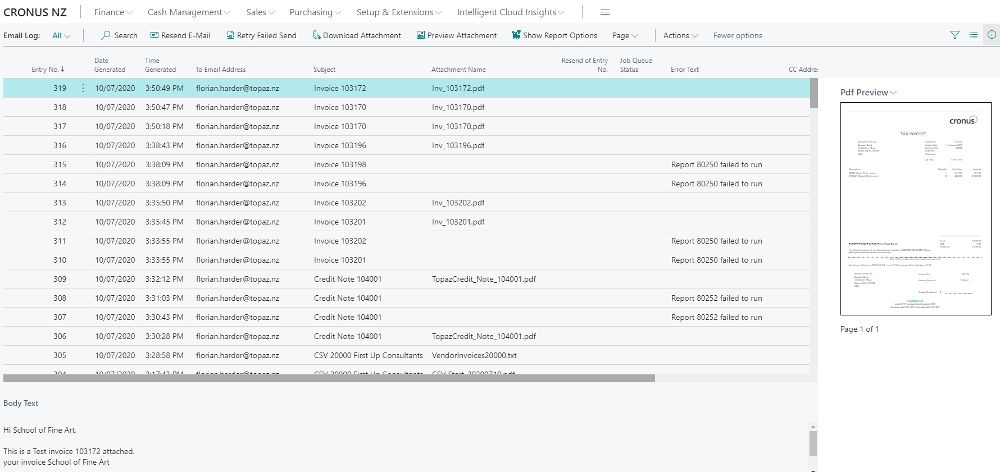

Use "Resend E-Mail" to create a new Email Log entry with the option to adjust E-Mail Address and content details before resending.

For the reprocessing of failed emails, for example due to wrong or  missing SMTP setup details, use "Retry Failed Send". This will not create a new Log Entry.

You can delete errornous Email Logs manually as these have not resulted in a send E-Mail. 

From the "PDF Preview" FactBox you can open a a larger view of the PDF document.

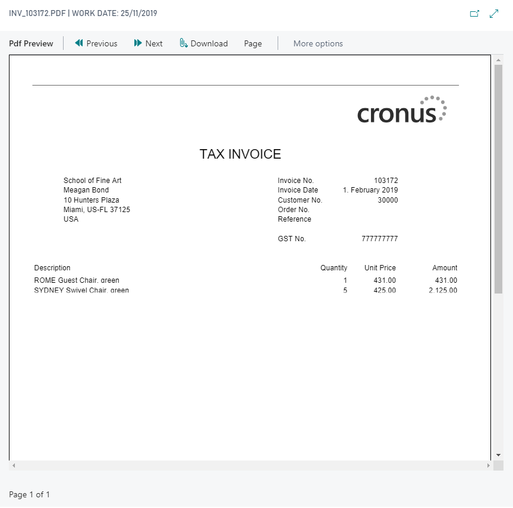

You can use __Actions > Download Attachment__ and __Actions > Download Add. Attachment__ to download the attached files.


### Email Log Error Notifications

You can enable Notifications for unsuccesfully send Emails that have __not__ been resend in the last week.
By Default this is disabled but can be activated under __My Notifications__ for every user.
Please be aware that this will include Reports run through Batch Processing that did not generate any output.

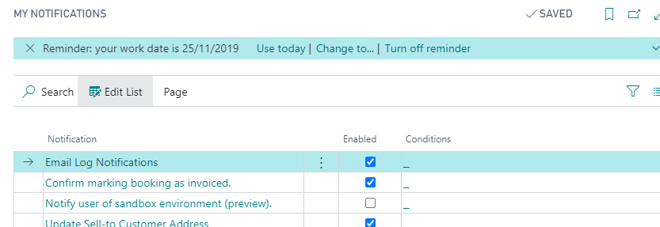

The Notifications will show up on your Role Center Page.

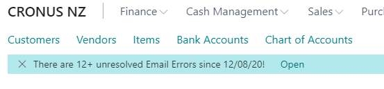

## Email Sending Setup

Email sending from BCv17 onwards can be done through the __SMTP Mail Setup__ or by using the __Email Account__ emailing Feature.

### SMTP Setup

The Report Parameter Emailing uses the standard SMTP Setup for Emailing. If Alias email addresses for the "From Email Address" are to be used these will need to be setup as such on the SMTP server. The user that authenticates to the mail server needs to have SendAs permission for any From Address used.

#### SMTP sending limits on local SMTP-servers

Standard settings can include sending limits of f.e. 6 emails per minute, thsi will interfere with batch sending jobs and should be adjusted.
Doing this is a task for the System Administrator of the SMTP server.

In Exchange console, issue the following command to check the limits (you have to use PowerShell for that, it's not available via EMC):
```powershell
Get-ReceiveConnector|ft Identity, Bindings, MessageRateLimit, MessageRateSource
```

It only seems to be applied if MessageRateSource is set to User (which is the case for authenticated connectors, like Client Frontend but not Default Frontend)

To change the limit, do this:
```powershell
Set-ReceiveConnector -Identity <ConnectorID> -MessageRateLimit <number>
```

### Email Account Setup

When the Email feature is enabled you can setup _Email Accounts_ using a shared Mailbox, the Current User Account or SMTP Accounts.
Please see standard Business Central documentation for details.

To Select these for you Report emailing deactivate the __Use Legacy SMTP Mail__ flag and select a __Email Scenario__.
This way the _Email Account_ associated with your emailing scenario will be used as teh sender account.

If you select a specific Account using the Assist function on the __Sender Email Name__ you can select a Account for this report that superceeds the __Email Scenario__ selected.

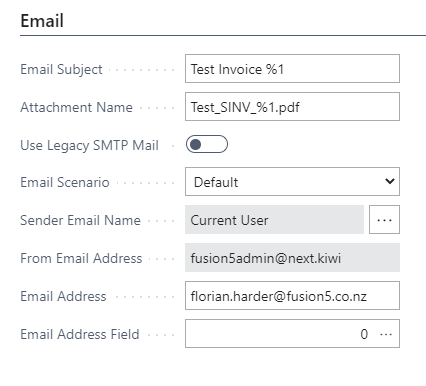

## Topaz Report Templates

Standard Template Reports for NZ Customers included: 

 - Report 80250 __Sales Invoice__
 - Report 80251 __Purchase Order__
 - Report 80252 __Sales Credit Memo__
 - Report 80253 __Customer Statement__
 - Report 80255 __Detailed Fixed Asset Book Value__
 - Report 80256 __Purchase Order (Released only)__
 - Report 80257 __Draft Sales Invoice__

## Topaz Data Redaction

When enabling the "Topaz Administration" Appliocation Area you get access to Data Redaction Functionality for SUPER user.

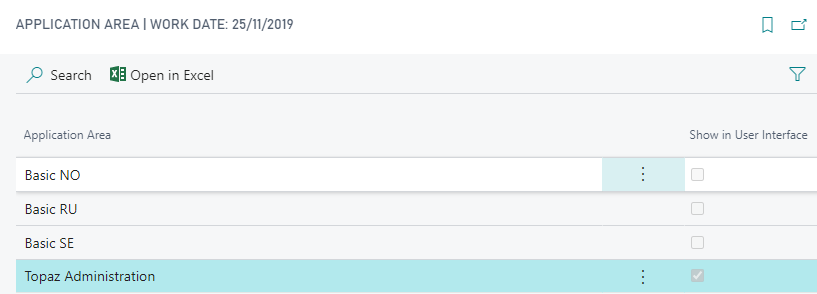

To enable this create a Configuration package for the Table 9178 "Application Area Setup" and set the corresponding flag for your relevant company.
If no entry exists copy the CRONUS.

You have the following functions from the "Topaz Report Parameter" list:

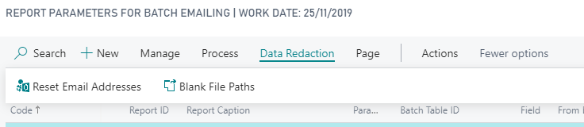

to replace email addresses and empty file path. This is not available in Saas Production environments for safety reasons.


