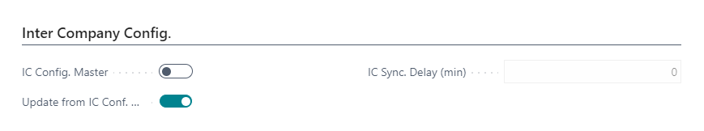
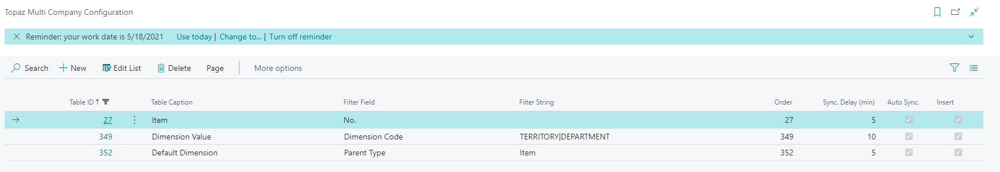
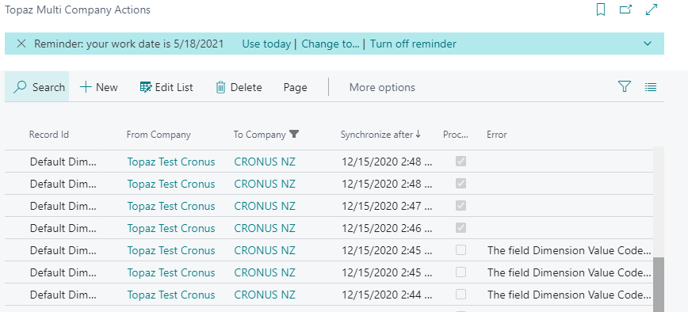
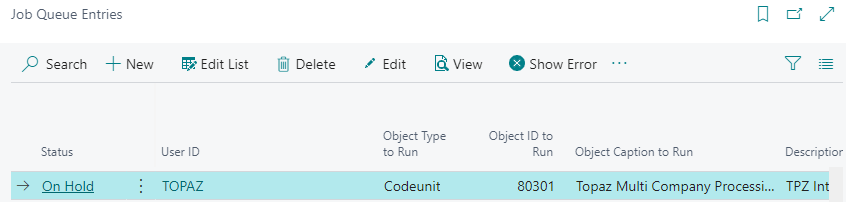

# Copy Master Company for Business Central

## Overview

Synchronize master data tables from a master company to other companies within the same environment.

## Setup

The Master Company is flagged as such in the __Company Information__ (Copy Comp. Config. Master) with a “Sync. Delay” to allow some room for undo etc.
Companies to be updated are flagged as well (Update from Copy Comp. Config. Master).

A IC Config is defined for Active Tables and a set of Fields with validation flags and a validation order.
A Filter on Record fields can be defined for this as well for example only copy Dimension Values for the BUSINESAREA Dimension.

You can unsubscribe specific Master tables at a Child company.

For copied fields default replacement vales can be defined

## Processing Flow

If a new Record is Inserted, Modified or Deleted a Copy Company Action is created.

The Copy Company Action is then picked up by a Job Queue running in the companies to be updated that create the Record requested.
It flags the transactions as processed once they are successfully processed or reports the validation error if appropriate.
Once the cause of the validation is fixed, the record processes next time the job runs or you can delete the record from the processing table if you don’t want it to process.

All processed Actions are stored in a Log Table.

> __Note:__ You can activate Notifications about Copy Company issues in "My Notifications"

> __Note:__ Renames in copied tables in the Master Company are prevented.
