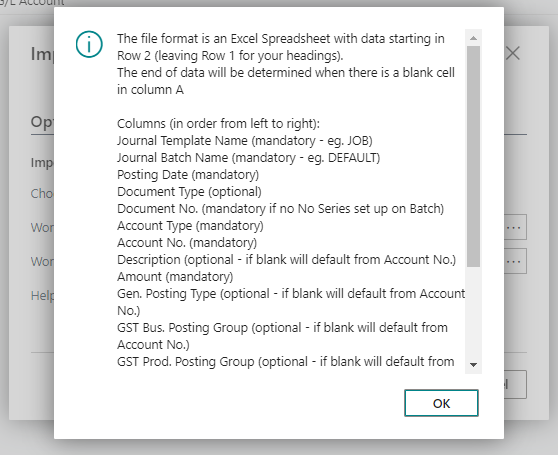

[[_TOC_]]

Overview
========

This Journal Import utility allows users to import the following
Dynamics BC records from Microsoft Excel.

Import G/L Journal from Excel
=============================

This function allows users to import G/L Journals from Excel using a
pre-defined excel template file.

Go to **Import G/L Journal from Excel**


Click on **Choose Excel File** when prompted, choose the Sheet you want
to import and click **OK**


The Import Options will be updated as per your import template, click
**OK**


Go to the General Journal Batch as specified in your import template to
review and post the journal


Once reviewed, you can post the journal.

Creating Templates for Excel Import
-----------------------------------

Each of our Excel Import functions has a **Help (File Layout)** option,
where the system will tell you what each column should be for that
specific import function. You can use this to create your own templates:



Import G/L Journal from Excel with Dynamic Columns
==================================================

This allows users to import G/L Journal transaction from Excel using a
User Definable excel format.

Dynamic Import Codes
--------------------

Go to **Dynamic Import Codes**


-   **Journal Code -- User definable code to define import layout**

-   **Import Type -- Options to create General journal, Sales or
    Purchase Invoices**

-   **Description -- User definable description to define import
    layout**

-   **Excel Row of First Data Line -- Line Number for first journal line
    in excel where data to be imported starts**

**Actions from the Ribbon**

-   **New -- Create new Layout**

-   **Delete -- Delete a Layout**

```{=html}
<!-- -->
```
-   **Import Columns from File -- Selected Excel file template for
    import to create required column layouts**

**Sample Excel File Layout**


-   **Excel Column No -- Column No from Excel**

-   **Excel Content -- Column heading from excel if Imported or manually
    entered No.**

-   **Journal Import Field Name -- General Journal field. This is a drop
    down list of all available files to allow the user to create there
    own custom mapping.**

-   **Default Value -- Default Value to include in integration of not
    provided by excel mapping**

**Mandatory Fields for Journal**

**The following fields are Mandatory and must be included in the excel
file or have a default value supplied.**

**JOURNAL TEMPLATE NAME - Standard Dynamics BC template name to define
type of journal.**

**JOURNAL BATCH NAME - Batch Name must already exist.**

**POSTING DATE -- Journal Posting Date.**

**ACCOUNT TYPE -- Account Type for Journal Line.**

**ACCOUNT NO -- Number based on account type.**

**AMOUNT -- Value for Journal.**

**Optional Fields**

**All optional fields can be supplied in the import mapping or left to
default in the same way as a manually entered journal.**

**DOCUMENT NO.**

**DESCRIPTION**

**DIMENSION**

**BAL. ACCOUNT TYPE**

**BAL. ACCOUNT NO.**

**DOCUMENT DATE**

**DOCUMENT TYPE**

**EXTERNAL DOCUMENT NO.**

**FA POSTING TYPE**

**GEN. POSTING TYPE**

**GEN. PROD. POSTING GROUP**

**GST BUS. POSTING GROUP**

**GST PROD. POSTING GROUP**

**JOB LINE TYPE**

**JOB NO.**

**JOB QUANTITY**

**JOB TASK NO.**

**JOB UNIT COST**

**JOB UNIT PRICE**

**RECURRING FREQUENCY**

**RECURRING METHOD**

**Mandatory Fields for Purchase Document (H\* is for Header fields and
L\* is for the lines**

**H.DOCUMENT NO.**

**H.VENDOR NO.**

**H.VENDOR INVOICE NO. or H.VENDOR CREDIT MEMO NO**

**H. POSTING DATE**

**L.TYPE**

**L.NO.**

L.QUANTITY

L.DIRECT UNIT COST

**Optional Fields**

H. DIMENSION 1 to 8

H. DOCUMENT TYPE

H. DUE DATE

H. PAY TO VENDOR

H. VENDOR NAME

H. ADDRESS 1

H. ADDRESS 2

H. POSTCODE

H. BUY-FROM CONTACT

L. DESCRIPTION

L. DIMENSION 1 TO 8

L. GEN PROD POSTING GROUP

L. GST PROD POSTING GROUP

L. JOB NO

L. JOB TASK NO

L. JOB PLANNING LINE NO

**Mandatory Fields for Sales Document (H\* is for Header fields and L\*
is for the lines**

H.CUSTOMER NO.

H.DOCUMENT DATE

H.DOCUMENT TYPE

H.EXTERNAL DOCUMENT NO

H.POSTING DATE

L.NO.

L.QUANTITY

L. TYPE

L.UNIT PRICE

**Optional Fields**

H.BILL-TO CUSTOMER NO.

H. DIMENSION 1 TO 8

H.DOCUMENT DATE

H.DUE DATE

H.EXTERNAL DOCUMENT NO

H. SELL-TO CONTACT

L. DESCRIPTION

L. DIMENSION 1 TO 8

L.GEN. PROD. POSTING GROUP

L.GST PROD. POSTING GROUP

Journal Import
--------------

Go to **Import from Excel with Dynamic columns**


-   **Import Code-- Select the required import code as defined above**

-   **Choose Excel File**-- This opens the standard Microsoft File
    selection utility. Navigate to the required file for import


-   **Workbook File Name** -- Filename to be imported

-   **Worksheet Name** -- Work Sheet in file

Journal Posting
---------------

Navigate to the required Journal template/batch or navigate to the Sales
Invoice or Purchase Invoice list page

Journal can be posted as per standard journal posting routines.
Documents can be reviewed or posted
