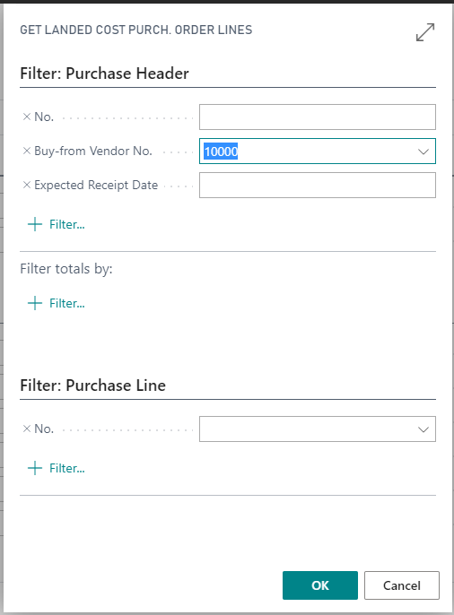

<!--  -->

# Landed Cost

[[_TOC_]]

# Introduction

The purpose of the Landed Cost extension is to allow item charges
relating to purchased items to be captured (from a purchase invoice) and
allocated to those purchased items. This will give a more realistic cost
of the purchased items.

The extension uses the concept of a Landed Cost card, onto which
purchase order lines for a shipment can be added, and invoice lines
relating to item changes for this shipment can also be added. The item
charges are then allocated to the items in the shipment.

A Landed Cost document can be created directly from a purchase order or
it can be manually created. Lines from multiple purchase orders can be
linked to the same Landed Cost document.

Purchase orders are created and receipted in BC as per standard
functionality.

Purchase order (PO) lines with a type of 'Item' are linked to the Landed
Cost document and therefore creation of the Landed Cost document can be
done in advance of the purchase order being receipted. As lines are
receipted, they will automatically be linked to the Landed Cost
document.

The system will generally refresh the assigned receipt lines as invoice
lines are inserted, modified or deleted or as PO lines are inserted,
modified or deleted. The system will also recalculate these lines
before invoicing to catch any late receipts.

Invoices can be created from the Landed Cost card, or if an invoice
already exists in BC, then the lines can be added to (or can replace
lines on) the existing invoice.

Once an invoice has been created for the Landed Cost document, the
Invoiced lines cannot be deleted or modified, nor can the Landed Cost
document be deleted.

Landed Costs, allocated to an item, can be seen as value entries on the
Item Ledger Entries.

# Set Up

## Landed Cost Setup Card

There is some basic setup required to use this extension. Firstly, go to
the Landed Cost Setup Card.

-   Landed Cost Nos. - this is standard BC number series logic to
    determine the number series for Landed Cost documents. It is
    necessary to allow default numbering on the number series so you can
    automatically create Landed Cost documents from a purchase order.
    You will need to have set up a Landed Cost number series. It is
    recommended that you use Automatic Numbering (on the Number Series)
    if you intend to create a Landed Cost card from a purchase order
    directly.

-   LC Vendor for G/L Costing - This is only used if you wish to use a
    dummy vendor no. against which you can create zero invoices (if you
    want to offset costs to a G/L Account). When the invoice is posted,
    the item changes will be assigned against the items, but the credit
    will go to the G/L account.

-   Handling of existing lines - When the lines from the Landed Cost
    card are transferred to a purchase invoice, there are options about
    how any existing lines on the invoice should be managed:

    -   Leave existing lines - Any existing lines on the invoice should
        remain (i.e. append the Landed Cost lines).

    -   Delete existing lines - Any existing lines on the invoice
        should be deleted (i.e. replace all existing purchase invoice
        lines with the Landed Cost lines).

    -   Prompt each time to delete existing lines - the user will be
        asked what they would like to do (leave or delete) the existing
        lines on the purchase invoice.

## Item Charges Card

Next you will need to either set up some Item Charges or add additional
information onto existing entries. In the Item Charges card, you can
set up information to default onto the Landed Cost document when an item
charges code is selected.

For each of the item charges:

-   LC Auto Insert - when ticked, this item charges code (and all the
    Landed Cost defaults mentioned below) will automatically be inserted
    onto a Landed Cost document when it is created.

-   LC Default Assignment Method - this is the assignment method to
    default on the Landed Cost document. This value will be used to
    determine how the item charges will be spread across the items from
    the purchase receipts. The options are:

    -   Manual - you will manually determine how to apportion the
        charges.

    -   Equally - apportion the same value against all linked purchase
        receipt lines

    -   Amount - apportion based on the \$ amount of each linked
        purchase receipt line

    -   Cubage - apportion based on the current cubage on the Item Unit
        of Measure Card multiplied by the quantity of each linked
        purchase receipt line

    -   Weight - apportion based on the current weight on the Item Unit
        of Measure Card multiplied by the quantity of each linked
        purchase receipt line

    -   Quantity - apportion based on the quantity of each linked
        purchase receipt line

-   LC Default Type - this is the source type to default on the Landed
    Cost document. Available source types are vendor or G/L Account.

-   LC Default Account No. - this is the source no. to default on the
    Landed Cost document when this item charge no. is selected (i.e. a
    vendor number or a G/L Account code)

-   LC Account Name (_display information only_) - this is the name of
    the vendor or G/L Account selected in the LC Default Account No.
    field.

# Landed Cost List

The Landed Cost cards can be accessed via the Landed Cost list (note -
the list is not editable).

By default, this will only show Landed Cost documents with a costing
status of 'Open'. However, you can remove filters on this page to see
all Landed Cost documents.

# Landed Cost Card

To create a Landed Cost card, you can either create one manually or
create one from a purchase order. You can add more purchase order
lines, from multiple purchase orders, to this Landed Cost card. Remember
that the Landed Cost card represents all costs for one shipment,
regardless if the costs are from multiple orders or different vendors.

Here we are going to create one from a purchase order. You can create
the Landed Cost card even if your order lines are not yet receipted.
However, to create an invoice from a Landed Cost document, you will have
to receipt at least some of the lines.

Note that the page will be editable only if the costing status is 'Open'
(except for the costing status which is always editable).

Click on the *Process* option on the ribbon of the purchase order.

Select *Create Landed Cost Document*:

This will open a newly created Landed Cost card. Note: If you have
accidentally invoked the action before completing all lines on the
purchase order, then just delete the Landed Cost document and continue
editing the purchase order.

There are four FastTabs on this page.

## General (_FastTab_)

-   No. - this is the number of the Landed Cost document, populated
    automatically by the number series assigned on the Landed Cost Setup
    card.

-   Costing Status - this can be either 'Open' or 'Closed'. A newly
    created document will have a status of 'Open'. When you have
    finished with the Landed Cost document, you can set the status to
    'Closed'.

A 'Closed' status means that no fields on the page can be editable.

> When you change the status from 'Open' to 'Closed' you will also be
> asked to confirm the change of status. If there are any Landed Cost
> invoicing lines that have not been invoiced (created document type is
> blank) then you will not be allowed to change the status from 'Open to
> 'Closed'.

-   Total Receipted Weight/Cubage - these are display fields showing
    the total receipted weight and cubage.

## Shipping (_FastTab_)

This FastTab contains various information only fields to describe the
Landed Cost document.

## Landed Cost Invoicing (_FastTab_)

-   Item Charge No. - the item charges code that will be assigned
    against the receipts. This is a mandatory field to create an
    invoice.

-   Source Type - 'Vendor' or 'G/L Account'.

    -   Selection of 'Vendor' will create an invoice against that
        vendor. This will be available for payment once posted. This
        is a mandatory field to create an invoice.

    -   Selection of 'G/L Account' will create an invoice against a
        dummy vendor (as set up in the Landed Cost Setup Card) to which
        all item charges are assigned. In addition, an offsetting credit
        line to the G/L Account specified in the Source No. field will
        be created (effectively creating a zero-value invoice).

-   Source No. - depending on the source type this will be either a
    valid vendor no. or G/L Account no. This is a mandatory field to
    create an invoice. Values may default from the Item Charges card.

-   Account Name. - The source name e.g. the vendor name or the G/L
    Account description is displayed.

-   Vendor Inv./Cr. Memo no. - when BC posts an invoice (or credit
    memo) it requires a vendor invoice number (or vendor credit memo
    number), which is unique for that vendor. This field is mandatory
    for a source type of 'Vendor'. For a source type of 'G/L Account'
    this field can be left blank (the system will automatically assign a
    value when creating the invoice.

-   Posting Date - this is the date put on the created invoice as the
    posting date. This is a mandatory field to create an invoice.

-   Currency Code - will default from the vendor card when a vendor
    source no. is selected but can be overridden. This is the currency
    of the invoice that will be created. If left blank, the default
    currency of your company will be used.

-   Amount - this is the total amount (excluding GST, in the specified
    currency) that will be invoiced. A negative value will generate a
    credit memo instead of an invoice. This is a mandatory field to
    create an invoice.

-   Amount Assigned - this is a display field only. This is the total
    amount (in the specified currency) that has been allocated against
    purchase receipt lines linked to this Landed Cost document.

-   Assignment Method - this can be either 'Manual' (which requires
    user entry) or a method that the system will calculate for you and
    you cannot edit manually. The automated methods available are:

    -   Equally - apportion the same value against all linked purchase
        receipt lines

    -   Amount - apportion based on the amount of each linked purchase
        receipt line

    -   Cubage - apportion based on the current cubage on the Item Unit
        of Measure Card multiplied by the quantity of each linked
        purchase receipt line

    -   Weight - apportion based on the current weight on the Item Unit
        of Measure Card multiplied by the quantity of each linked
        purchase receipt line

    -   Quantity - apportion based on the quantity of each linked
        purchase receipt line

-   Currency Factor - this is a display field only and is the current
    exchange rate for the currency code on the posting date.

-   Amount (LCY) - this is a display field only and is the amount
    divided by the currency factor.

-   Created Document Type - this is a display field only and it will be
    blank until the line is invoiced and then will be either 'Invoice'
    or 'Credit'.

-   Created Document No. - this is a display field only and it will be
    blank until the line is invoiced and then it will be the unposted
    invoice or credit memo number.

-   Posted Document No. - this is a display field only and it will be
    blank until the line is invoiced and posted, then it will be the
    posted invoice or credit memo number.

-   Total Cost Posted (Direct) - the total cost of this invoice that is
    allocated directly to the Item.

-   Total Cost Posted (Incl. Var) - the total cost of this invoice that
    is allocated to the item, both directly and as a result of
    variances. (For example, an item has a Standard Unit Cost of \$10.
    If you first purchase it (the original receipt is invoiced) for \$8,
    then you will get a Direct Cost of \$8 plus a variance of \$2 (to
    make it up to \$10 per unit). Every subsequent posting will totally
    negate itself - i.e. If you post a Freight Item Charge for \$5 you
    will get a Direct Cost of \$5 and a variance of minus \$5 so that
    the Unit Cost stays at \$10. Therefore, if every Item being assigned
    against is a Standard Cost Item then the last column will be zero.

Within this _FastTab_ there are two actions we wish to look at:

Assign Costs

Select 'Assign Costs' to open the Landed Cost Assignment page for the
Landed Cost invoicing line that you are on. The assigned amount field
shows the portion of the Landed Cost invoicing line amount that is
assigned to each receipt line. This field will only be editable if the
costing status is 'Open' and the assignment method is 'Manual'.

Create Invoice

This will generate an invoice for the line that you are on subject to
the following:

-   all the mandatory fields have been completed.

-   the line must not already have a 'Created Document Type/No.'

-   the amount must equal the amount assigned.

-   

You will be asked to confirm continuation if any PO Line has a receipt
status of 'Not Fully Receipted'.

An invoice or credit memo will be created, and that card is then
opened.

If an unposted invoice (or credit memo) for that vendor and vendor
invoice number (or credit memo) already exists, the invoice lines from
the Landed Cost card will be created on the existing document, subject
to the Landed Cost Setup rules.

## PO Line (_FastTab_)

-   You cannot manually insert or modify any fields in this FastTab (see
    actions below), however you can delete a link if you no longer
    require it. This will not remove any Landed Cost assignment of an
    invoiced line.

-   PO No. / PO Line No. - this is the exact link to the purchase order
    line. Note: this may no longer exist if the purchase order has been
    fully invoiced as BC may have removed it. The link will still be
    appropriate for the purchase receipt lines.

-   PO Item No. - this is the item no. entered on the purchase order
    line. Note: if this is blank then it indicates that the purchase
    order has been deleted.

-   Receipted Item No./Receipted Quantity - these are the item no. and
    total quantity receipted (all receipted) that are linked to that
    purchase order line.

-   Receipt Status - this is for information only. It will be either
    blank or 'Not Fully Receipted' (if the 'PO Quantity' is greater than
    the 'Receipted Quantity').

-   Receipt Direct Unit Cost - The Unit Cost from the linked receipt
    line (to 2dp)

-   Unit Cost This Landed Cost - The Unit Cost from this Landed Cost
    card (to 2dp)

-   Unit Costs Other Landed Costs - No longer used and will be removed
    in the next version.

-   Unit Cost Other - Any other costs added to the Unit Cost (to 2dp)

-   Total Cost This Landed Cost - The total of the previous three
    fields, multiplied by the Receipted Quantity (to 2dp)

    

## Landed Cost Card (_Actions_)

If you wish to create the Landed Cost card manually, there are two
actions on the ribbon that can help you.

**Get PO Lines from POs**

This will attach any purchase order lines to this Landed Cost document
according to the filters used. You must enter something in one of the
filters (to stop you accidentally linking every single PO line!) -
perhaps you want to select a particular purchase order no. or a
particular vendor - or maybe a particular item no. from the lines. The
system will error if you try to add a purchase order line that has been
used on any previous Landed Cost document.

**Get PO Lines from Receipts**

Generally, this would only be used for initial data conversion or if you
forget to create the Landed Cost document before the purchase order was
fully receipted and invoiced. This does the same thing as the 'Get PO
Lines from POs' action, however it looks at posted receipt lines instead
of purchase order lines to create the links.

**Printing a Landed Cost card**

From the ribbon select Print.

# Item Ledger Entries

You can view the assigned Landed Costs against an item by going to Item
Ledger Entries.

In this example we have filtered on an item code (70060) and then for
one of the ledger entries, we are drilling down to look at the value
entries:

Select one of the lines and go to Entry\>Value Entries on the ribbon:

If you scroll to the right, you will see the Landed Cost card number and
line number from which this entry was created:

