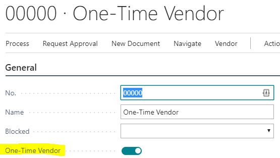
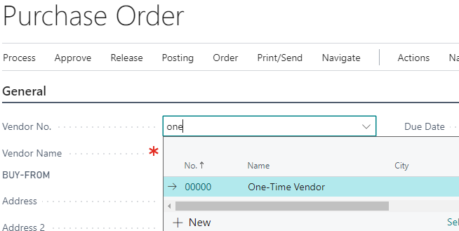
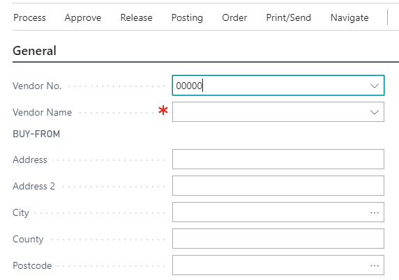
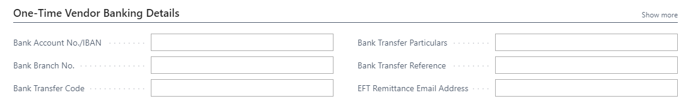
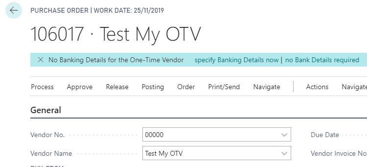
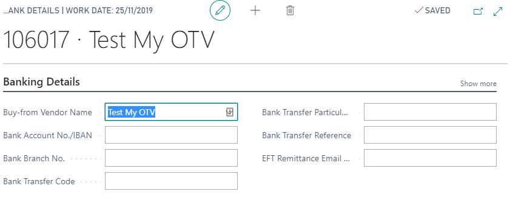

 

 
User Manual
 
________________
 
One-Time Vendors for Business Central
 
 
 

# Overview

Create a One-Time Vendors for use in one-off purchases to avoid setting up Vendors that are only used once.

# Setup

Once the Topaz One-Time Vendor has been installed a notification will suggest creating a One-Time Vendor if none exists when opening a Purchase Order/Invoice.

*missing pic*

Alternatively A One-Time Vendor can be created by setting the One-Time Vendor Flag on a new Vendor.

## Installation

after the install existing Purchase Orders/Invoice will need to update the "One-Time Vendor Name" with the "Buy-from Vendor Name" using a configuration package.

# Using a One-Time Vendor

The One-Time Vendor can be selected like a normal Vendor, but you will need to enter a Name and Address details on the Purchase Document.

Details from the actual Vendor Card will not be used.

As required additional banking Details can be entered via the "One-Time Vendor Banking Details" section.

Alternatively you can edit this from a notification on the Purchase Order/Invoice.

  

an additional Page will be opened

## Use with EFT

To use this with EFT the Topaz Direct Credit extension is required as well as the integration extension handling the retrieval of One-Time Vendor details for the Direct Credit extension "Topaz OTV-EFT"