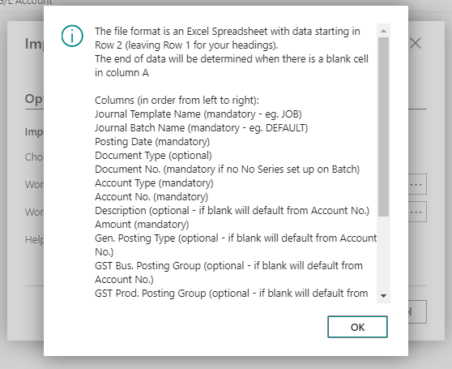
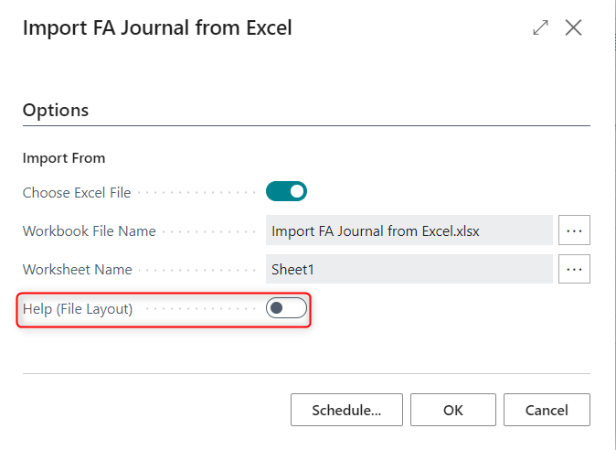
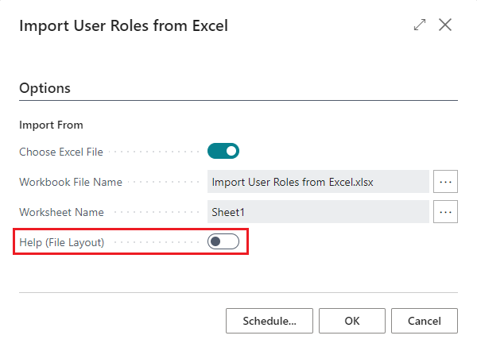
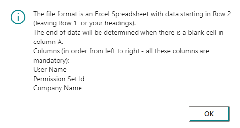

# Import from Excel

## **Overview**

The Import from Excel extension enables import of data in Business Central using templates created in Microsoft Excel. This includes importing Master Data as well as Transactional Data, such as Sales Documents, Purchase Documents, and Journals.  

This extension supports both "static imports" with predefined file formats for Master Data and General Journals; and "dynamic imports" for Journals and Purchase/Sales Documents, allowing users to create custom templates based on their specific Excel formats.

## **Dynamic Imports**
Users can create custom templates in Microsoft Excel based on file formats from external systems and specify how data should be managed during import. When defining dynamic import codes, column definitions can be directly imported from these templates, streamlining the setup process. Users can then map the column data to the relevant fields in Business Central documents or journals and set default values for any required information missing from the file. 

Templates can be set up to: 

- Import data to General Journals
- Create or update Purchase Invoices and Credit Memos
- Create or update Sales Invoices and Credit Memos

NB: Dynamic Imports are used to import documents and journals. For import of Master Data, Static Import should be used.

### **Setting up Dynamic Import Codes**

To use Dynamic Imports, you first need to set up Dynamic Import Codes. These can be created to import Purchase Documents, Sales Documents and Journals.

Go to **Dynamic Import Codes**. This is accessible from the following places:
-	Search > **Dynamic Import Codes**
-	From General Journal > Home > **Dynamic Import Codes**
-	From the Purchase Invoice list > Home > **Dynamic Import Codes**
-	From the Sales Invoice list > Home > **Dynamic Import Codes**

To create new dynamic import code enter the following information:

-   **Code** - User definable code to specify import layout
-   **Import Type** - Select from General journal, Purchase Document or Sales Document
-   **Description** - User definable description to define import layout
-   **Excel Row of First Data Line** - Line Number for first journal line in excel where data to be imported starts

Select **Import Columns from File** to import and setup columns from an excel file. Map these columns to corresponding journal fields:

- **Excel Column No** – Column No from Excel or manually entered no. after the excel column numbers
- **Excel Content** – Column heading from excel if Imported or blank for defaults
- **Journal Import Field Name** – General Journal field.  This is a drop down list of all available files to allow the  user to create there own custom mapping.
- **Default Value** – Default Value to include in integration if not provided by excel mapping
- **Transformation Rule** – look up to the standard transformation rules and select relevant rule for the field (ie TITLECASE will capitalize the first letter of each word)

**Sample Excel File Layout**

An example of an Excel file with corresponding mapping is provided below. Where the Excel file does not contain values a default value has been mapped for the same. 

**Please note** that the default value is applied to all transactions and lines contained in the Excel template.

**Dynamic Import Code Mapping**

#### **Dynamic General Journal Template - Field Selection** 

When creating a **Dynamic Import Code** template to import General Journals the field selections are as follow:

_**Mandatory Fields**_

The following fields are Mandatory and must be included in the excel file or have a default value supplied in the column mapping.

- **Journal Template Name** - Standard Dynamics BC template name to define type of journal. **(*)**
- **Journal Batch Name** - Batch Name must already exist.  **(*)**
- **Posting Date** - Journal Posting Date.
- **Account Type** - Account Type for Journal Line.  **(*)**
- **Account No.** - Number based on account type.  **(*)**
- **Amount** - Value for Journal.
- **Document No.** - this is only mandatory if the no. series is not specified on the journal template or batch.

**(*)** Values provided under these columns must be defined in Business Central, else an error message will be displayed on import.

_**Optional Fields**_

All optional fields can be supplied in the import mapping or left to default in the same way as a manually entered journal.

- **Document No.**
- **Description**
- **Shortcut Dimensions 1-8** - Global and Shortcut dimensions can be included in the template as separate columns based on the dimension setup for the company
- **Bal. Account Type**
- **Bal. Account No.**
- **Document Date**
- **Document Type**
- **External Document No.**
- **FA Posting Type**
- **Gen. Posting Type**
- **Gen. Prod. Posting Group**
- **Gen. Bus. Posting Group**
- **GST Bus. Posting Group**
- **GST Prod. Posting Group**
- **GST Amount**
- **Project Line Type**
- **Project No.**
- **Project Quantity**
- **Project Task No.**
- **Project Unit Cost**
- **Project Unit Price**
- **Recurring Frequency**
- **Recurring Method**

#### **Field Selection for Dynamic Purchase Document Templates**

When creating a **Dynamic Import Code** template to import Purchase Invoices and Credit Memos the field selections are as follow:

**_Mandatory Fields_** for Purchase Document. **(Hdr)** is for Header fields and **(Line)** is for the lines:
- **Document No. (Hdr)**
- **Buy from Vendor No. (Hdr)**
- **Vendor Invoice No. (Hdr) or Vendor Credit Memo No. (Hdr)**
- **Posting Date (Hdr)**
- **Type (Line)**
- **No. (Line)**
- **Quantity (Line)**
- **Direct Unit Cost (Line)**

**NB**: If Mandatory fields are not in the excel file, add additional lines below the excel fields; populate Excel column no, Import Field name and Default Value (such as Account Type in screenshot above)

_**Optional Fields**_

- **Dimensions 1-8 (Hdr)**
- **Due Date (Hdr)**
- **Buy-from Vendor Name (Hdr)**
- **Buy-from Address (Hdr)**
- **Buy-from Address 2 (Hdr)**
- **Buy-from Contact No. (Hdr)**
- **Buy-from Post Code (Hdr)**
- **Currency Code (Hdr)**
- **Document Date (Hdr)**
- **Pay-to Vendor No. (Hdr)**
- **Posting No. (Hdr)** - If you require the posted invoice to have a specific posted document number
- **Description (Line)**
- **Description 2 (Line)**
- **Dimensions 1-8 (Line)**
- **IC Partner Code (Line)**
- **IC Ref. Type (Line)**
- **IC Reference (Line)**
- **Gen. Prod. Posting Group**
- **GST Prod. Posting Group**
- **Project No.**
- **Project Planning Line No.**
- **Project Task No.**

#### **Field Selection for Dynamic Sales Document Templates**

When creating a **Dynamic Import Code** template to import Sales Invoices and Credit Memos the field selections are as follow:

**_Mandatory Fields_** for Sales Document. **(Hdr)** is for Header fields and **(Line)** is for the lines:

- **Sell-to Customer No. (Hdr)**
- **Document Date (Hdr)**
- **Document Type (Hdr)**
- **External Document No. (Hdr)** - If mandatory in Sales & Receivables setup
- **Posting Date (Hdr)**
- **Type (Line)**
- **No. (Line)**
- **Quantity (Line)**
- **Unit Price (Line)**

_**Optional Fields**_

- **Bill-to Customer No. (Hdr)**
- **Dimensions 1-8 (Hdr)**
- **Document Date (Hdr)**
- **Due Date (Hdr)**
- **External Document No. (Hdr)** - If not mandatory in Sales & Receivables setup
- **Payment Discount % (Hdr)**
- **Payment Terms Code (Hdr)**
- **Posting No. (Hdr)** - If you require the posted invoice to have a specific posted document number
- **Posting Description (Hdr)**
- **Salesperson Code (Hdr)**
- **Currency Code (Hdr)**
- **Sell-to Contact No. (Hdr)**
- **Description (Line)**
- **Description 2 (Line)**
- **Dimensions 1-8 (Line)**
- **Gen. Prod. Posting Group (Line)**
- **GST Prod. Posting Group (Line)**
- **Return Reason Code (Line)**
- **Work Type Code (Line)**

### **Import Documents/Journals using Dynamic Import Codes**

To import Journals and Documents using the Dynamic Import Codes; go to **Import from Excel with Dynamic columns**.  This is accessible from the following places:
-	Search > **Import from Excel with Dynamic Columns**
-	From General Journal > Home > **Import from Excel with Dynamic Columns**
-	From the Purchase Invoice list > Home > **Import from Excel with Dynamic Columns**
-	From the Sales Invoice list > Home > **Import from Excel with Dynamic Columns**

Enter required information on the request form:

- **Import Type** - Select relevant option: General Journal, Purchase Document, Sales Document. If the Import from Excel function is chosen from General Journal/Purchase Invoice list/Sales Invoice List, the Import Type will be populated with the correct type for it.
- **Import Code** - Select the required import code as defined above; please note this will be pre-populated with the first relevant code for the Import Type selected above.
- **Override Posting Date** – Populate with date to override the posting date, or leave blank to import date from file
- **Override Journal Template** – Select a value from the dropdown to override the journal template value in file (only relevant for journals)
- **Override Journal Batch** - Select a value from the dropdown to override journal batch in file (only relevant for journals)
- **Write Option** – Select option:
  - Append to add to existing lines on journal batch, purchase invoice or sales invoice
  - Overwrite to replace lines on journal batch, purchase invoice or sales invoice (NB: This is possible on Purchase/Sales Documents only if a Document No. is supplied in the Excel Template)
-  **Choose Excel File** - This opens the standard Microsoft File selection utility. Navigate to the required file for import.  NB: if multiple worksheets are available in the workbook an option to select worksheet will pop up.

-   **Workbook File Name** - Displays the Workbook name to be imported

-   **Worksheet Name** - Displays the Worksheet being imported from

### **Posting**

Navigate to the desired Journal template/batch or go to the Sales Invoice or Purchase Invoice list page.

Journal can be posted as per standard journal posting routines. Documents can be reviewed or posted.

## **Static Imports**

Static Data imports use a specified format and are designed for importing substantial amounts of Master, as well as some transactional data. 

At present it includes import into the tables listed below:

- G/L Journal
- Items
- Resources
- Vendors
- Customers
- Fixed Assets
- FA Journals
- Jobs/Tasks
- Job Journal
- Job Budgets
- User Roles
- Dimensions
- Purchase Invoice/Credit

NB: Shortcut dimensions have been included in the templates and can be imported within the static data imports.

You can locate these Static Imports by searching for "Import from Excel"

1. __Import G/L Journal from Excel:__ Allows users to import General Ledger journal entries, including account codes, descriptions, posting dates and amounts from an Excel file.
 1. __Import G/L Accounts from Excel:__ Enables the import of General Ledger account information, including account codes, descriptions, and account types from an Excel file.
1. __Import Item from Excel:__ Allows users to import item data, including item codes, descriptions, prices, and other details, directly from an Excel file into the system.
 1. __Import Item Journal from Excel:__ Enables the import of item journal entries, including item codes, descriptions, quantities, and values from an Excel file.
 1. __Import Resources from Excel:__ Facilitates the import of resource information from an Excel spreadsheet.
 1. __Import Vendors from Excel:__ Enables the import of vendor details, including vendor names, addresses, payment terms, posting groups and other data from an Excel file.
 1. __Import Customers from Excel:__ Allows users to import customer data, including customer names, addresses, payment terms, posting groups and other data from an Excel file.
 1. __Import Fixed Assets from Excel:__ Allows users to import fixed asset information, including asset codes, descriptions and classification from an Excel file.
 1. __Import FA Journal from Excel:__ Facilitates the import of Fixed Assets journal entries, including asset codes, posting dates, and values from an Excel spreadsheet.
 1. __Import Job/Tasks from Excel:__ Enables the import of job and task details, such as job codes, job descriptions, job tasks, bill to customer, and start and end dates from an Excel file.
 1. __Import Job Journal from Excel:__ Facilitates the import of job journal entries, including job codes, posting date, quantity, cost and price from an Excel spreadsheet.
 1. __Import Job Budgets from Excel:__ Facilitates the import of job budget details, including job codes, budgeted costs, and revenues from an Excel spreadsheet.
 1. __Import Access Controls from Excel:__ Allows users to import access control settings, including approval user, approval group and limit from an Excel file.
 1. __Import Dimension Values from Excel:__ Facilitates the import of dimension values, including dimension codes, dimension values and descriptions from an Excel spreadsheet.

### **Import G/L Journal from Excel**

This function allows users to import G/L Journals from Excel using a pre-defined excel template file.

- Go to **Import G/L Journal from Excel**

- Set **Choose Excel File** to True, and select the file you want to import
- To view the required file layout set **Help (File Layout)** to True 
- Click **OK**
- Go to the **General Journal Batch** as specified in your import template to review and post the journal

- Once reviewed, you can post the journal.

**Template for G/L Journal Excel Import**

Each of our Excel Import functions has a **Help (File Layout)** option, where the system will tell you what each column should be for that specific import function. You should design your data import using this to define the column layout:

Please note: 
- This screenshot does not contain all fields in template - please run the **Import G/L Journal from Excel** function, and set the **Help (File Layout)** to True to see remaining fields.

### **Import G/L Accounts from Excel**

This function allows users to import G/L Accounts from Excel using a pre-defined excel template file.

- Search for **Import G/L Accounts from Excel**

- Set **Choose Excel File** to True, and select the file that you want to import
- To view the required file layout set **Help (File Layout)** to True 
- Click **OK**
- Go to the G/L Account List to review your new G/L Accounts

**Template for G/L Accounts Excel Import**

The Import from Excel **Help (File Layout)** option will tell you what each column should be for the specific import function. You should design your data import using this to define the column layout:

Please note: 
- If a G/L Account exists with the same number, then their details will be overwritten.

### **Import Items from Excel**

This function allows users to import Items from Excel using a pre-defined excel template file.

- Search for **Import Items from Excel**

- Set **Choose Excel File** to True, and select the file that you want to import
- To view the required file layout set **Help (File Layout)** to True 
- Click **OK**
- Go to the Item List to review your new Items

**Template for Items Excel Import**

The Import from Excel **Help (File Layout)** option will tell you what each column should be for the specific import function. You should design your data import using this to define the column layout:

Please note: 
- This screenshot does not contain all fields in template - please run **Import Item from Excel** function, and set the **Help (File Layout)** to True to see remaining fields.
- If an Item exists with the same number, then their details will be overwritten.

### **Import Item Journals from Excel**

This function allows users to import Item Journals from Excel using a pre-defined excel template file.

- Search for **Import Item Journals from Excel**

- Set **Choose Excel File** to True, and select the file that you want to import
- To view the required file layout set **Help (File Layout)** to True 
- Click **OK**
- Go to the Item Journal List to review your new Item Journals

**Template for Item Journals Excel Import**

The Import from Excel **Help (File Layout)** option will tell you what each column should be for the specific import function. You should design your data import using this to define the column layout:

Please note: 
- This screenshot does not contain all fields in template - please run **Import Item Journals from Excel** function, and set the **Help (File Layout)** to True to see remaining fields.
- If a Item Journal exists with the same number, then their details will be overwritten.

### **Import Resources from Excel**

This function allows users to import Resources from Excel using a pre-defined excel template file.

- Go to **Import Resources from Excel**

- Set **Choose Excel File** to True, and select the file that you want to import
- To view the required file layout set **Help (File Layout)** to True 
- Click **OK**
- Go to the Resource List to review your new Resources

**Template for Resource Excel Import**

The Resource Excel Import function **Help (File Layout)** option will tell you what each column should be for the specific import function. You should design your data import using this to define the column layout:

- Please note if a Resource exists with the same number then their details will be overwritten.

### **Import Vendor from Excel**

This function allows users to import Vendors from Excel using a pre-defined excel template file.

- Go to **Import Vendors from Excel**

- Set **Choose Excel File** to True, and select the file that you want to import
- To view the required file layout set **Help (File Layout)** to True 
- Click **OK**
- Go to the Vendor List to review your new Vendors

**Template for Vendors Excel Import**

The Vendor Excel Import functions **Help (File Layout)** option will tell you what each column should be for the specific import function. You should design your data import using this to define the column layout:

Please note: 
- This screenshot does not contain all fields in template - please run **Import Vendor from Excel** function, and set the **Help (File Layout)** to True to see remaining fields.
- If a Vendor exists with the same number then their details will be overwritten.

### **Import Customers from Excel**

This function allows users to import Customers from Excel using a pre-defined excel template file.

- Go to **Import Customers from Excel**

- Set **Choose Excel File** to True, and select the file that you want to import
- To view the required file layout set **Help (File Layout)** to True 
- Click **OK**
- Go to the Customer List to review your new Customers

**Template for Customer Excel Import**

The Customer Excel Import functions **Help (File Layout)** option will tell you what each column should be for the specific import function. You should design your data import using this to define the column layout:

Please note: 
- This screenshot does not contain all fields in template - please run **Import Customer from Excel** function, and set the **Help (File Layout)** to True to see remaining fields.
- If a Customer exists with the same number then their details will be overwritten.

### **Import Fixed Assets from Excel**

This function allows users to import Fixed Assets from Excel using a pre-defined excel template file.

- Search for **Import Fixed Assets from Excel**

- Set **Choose Excel File** to True, and select the file that you want to import
- To view the required file layout set **Help (File Layout)** to True 
- Click **OK**
- Go to the Fixed Asset List to review your new Fixed Assets

**Template for Fixed Assets Excel Import**

The Import from Excel **Help (File Layout)** option will tell you what each column should be for the specific import function. You should design your data import using this to define the column layout:

Please note: 
- This screenshot does not contain all fields in template - please run **Import Fixed Assets from Excel** function, and set the **Help (File Layout)** to True to see remaining fields.
- If a Fixed Asset exists with the same number, then their details will be overwritten.

### **Import FA Journal from Excel**

This function allows users to import FA Journals from Excel using a pre-defined excel template file.

- Go to **Import FA Journals from Excel**

- Set **Choose Excel File** to True, and select the file that you want to import
- To view the required file layout set **Help (File Layout)** to True 
- Click **OK**
- Go to the FA Journal to review your new journal entries

**Template for FA Journal Excel Import**

The FA Journal Excel Import functions **Help (File Layout)** option will tell you what each column should be for the specific import function. You should design your data import using this to define the column layout:

### **Import Jobs/Tasks from Excel**

This function allows users to import Jobs/Tasks from Excel using a pre-defined excel template file.

- Go to **Import Jobs/Tasks from Excel**

- Set **Choose Excel File** to True, and select the file that you want to import
- To view the required file layout set **Help (File Layout)** to True 
- Click **OK**
- Go to Projects to review your new entries

**Template for Jobs/Tasks Excel Import**

The Jobs/Tasks Excel Import functions **Help (File Layout)** option will tell you what each column should be for the specific import function. You should design your data import using this to define the column layout:

Please note:
- If a Project/Job/Task exists with the same number then their details will be overwritten.

### **Import Job Journals from Excel**

This function allows users to import Job Journals from Excel using a pre-defined excel template file.

- Search for **Import Job Journals from Excel**

- Set **Choose Excel File** to True, and select the file that you want to import
- To view the required file layout set **Help (File Layout)** to True 
- Click **OK**
- Go to the Job Journal List to review your new Job Journals

**Template for Job Journals Excel Import**

The Import from Excel **Help (File Layout)** option will tell you what each column should be for the specific import function. You should design your data import using this to define the column layout:

Please note: 
- This screenshot does not contain all fields in template - please run **Import Job Journals from Excel** function, and set the **Help (File Layout)** to True to see remaining fields.
- If a Job Journal exists with the same number, then their details will be overwritten.

### **Import Job Budgets from Excel**

This function allows users to import Job Budgets from Excel using a pre-defined excel template file.

- Search for **Import Job Budgets from Excel**

- Set **Choose Excel File** to True, and select the file that you want to import
- To view the required file layout set **Help (File Layout)** to True 
- Click **OK**
- Go to the Job Budget List to review your new Job Budgets

**Template for Job Budgets Excel Import**

The Import from Excel **Help (File Layout)** option will tell you what each column should be for the specific import function. You should design your data import using this to define the column layout:

Please note: 
- This screenshot does not contain all fields in template - please run **Import Job Budgets from Excel** function, and set the **Help (File Layout)** to True to see remaining fields.
- If a Job Budget exists with the same number, then their details will be overwritten.

### **Import User Roles from Excel**

This function allows users to import additional User Role associations from Excel using a pre-defined excel template file.

- Search for **Import User Roles from Excel**

- Set **Choose Excel File** to True, and select the file that you want to import
- To view the required file layout set **Help (File Layout)** to True 
- Click **OK**
- Go to the User List to review your new User Role associations

**Template for User Roles Excel Import**

The Import from Excel **Help (File Layout)** option will tell you what each column should be for the specific import function. You should design your data import using this to define the column layout:

### **Import Dimension Values from Excel**

This function allows users to import Dimension Values from Excel using a pre-defined excel template file.

- Search for **Import Dimension Values from Excel**

- Set **Choose Excel File** to True, and select the file that you want to import
- To view the required file layout set **Help (File Layout)** to True 
- Click **OK**
- Go to the Dimension Value List to review your new Dimension Values

**Template for Dimension Values Excel Import**

The Import from Excel **Help (File Layout)** option will tell you what each column should be for the specific import function. You should design your data import using this to define the column layout:

Please note: 
- If a Dimension Value exists with the same number, then their details will be overwritten.

