# Manual Microsof Graph Online Drive Integration

## Overview

Allow you to access SharePoint drives via the Microsoft Graph API.

### Setup an OAuth2.0 Application

Search for _OAuth 2.0 Application_

Create a new entry filling in required details from the Azure Portal App Registration
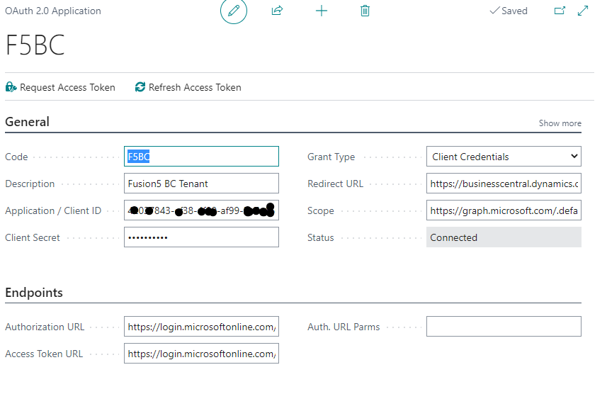
Rights setup as User Delegation or OneDrive access will require Authorization Code authentication.

It is recommended to _Use BC OAuth 2.0_ when using _Authorization Code_ authentication as this will allow using a refresh token to keep the login alive without further authentication callbacks. __You need to specify a__ ***Token Expire In (Sec.)*** __value__ recommended is something close but less then 30min. but this depends on your setups.

Under _Authentication Interaction_ you can define if a consent is requested, should that be required on initial runs. 

### Setup the Online Drive

Online Drives Setups allow for automatic importing and processing of folders.
You can navigate to files through Sites, Shared Drives and Groups.

Search for _Online Drive Setup_ create a new entry for every folder to be imported
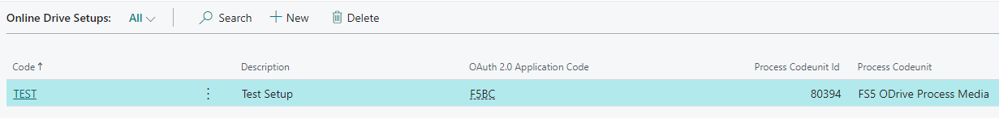

Crate a new entry and select a OAuth Application 
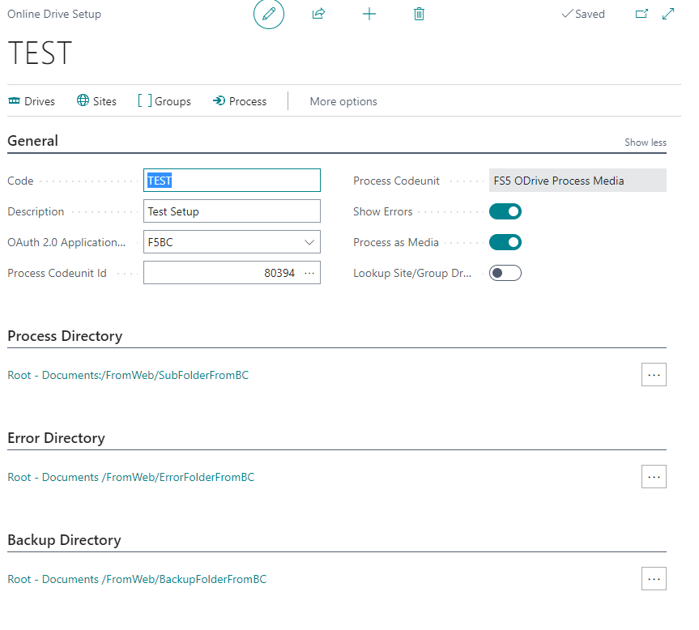

Use the assist edits on the Directory to select a Drive
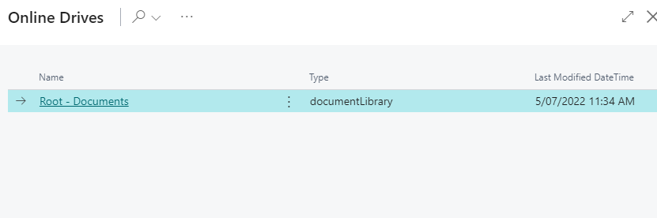
and a folder
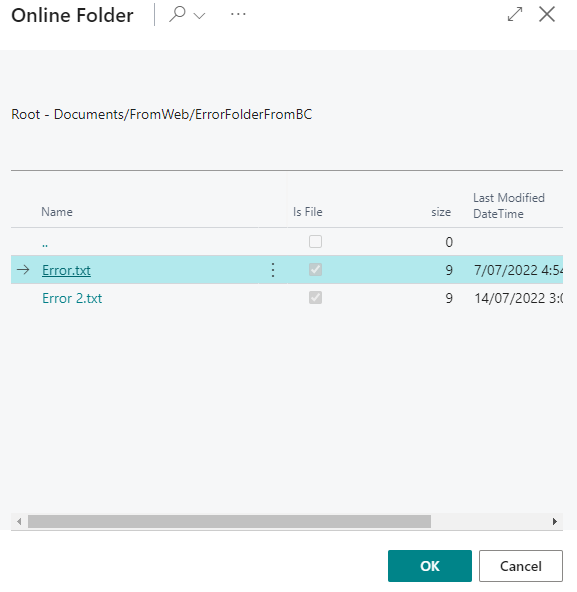

Processing can be done directly through _Process_ or setup a __Job Queue Entry__

_Drives_, _Sites_ and _Groups_ actions can be used to navigate to the available SharePoint Drives and setup the required folder structures

__Favorite a Drive__

using the _Add to Favorites_ page action on the drive selection a drive can be added as a Favorite to all Drive selections for easier selection. 
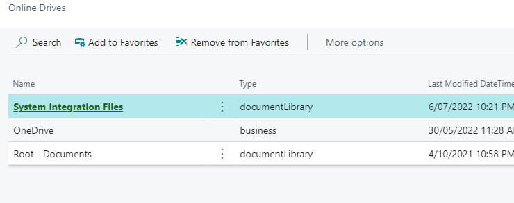

__Advanced Settings (Show More)__

 - Select _Show Errors_ to error instead of skip failed folder access
 - Select _Process as Media_ for your Processing Codeunit to be based on the __Tenant Media__ table. This will allow to have Codeunits for the processing that not require  dependency on the __Fusion5 Online Drive__ extension.
 - Select _Lookup Site/Group Drive_ to directly lookup Drives via the Sites/Groups selection for the Directory setup.
 - Select _Find recent Drives_ to include recently used drives for the current authenticated user. This allows selecting drives that are otherwise hard to navigate to due to access right limitations.
 - Set a _Search Filter_ to limit the displayed Sites

### Setup On Job Queue

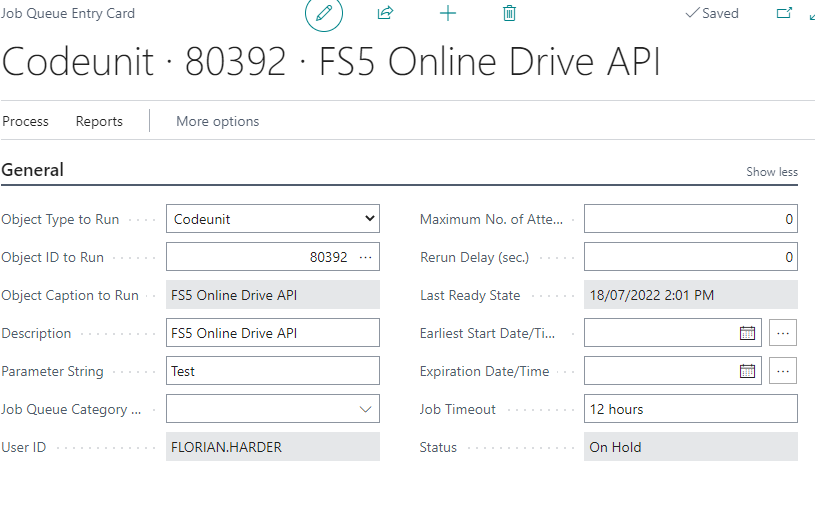
Run Codeunit 80392 __FS5 Online Drive API__ specify the __Online Drive Setup__ through the _Parameter String_.
You can run multiple setups by comma separating them 

To Run an import from the Job Queue you will need to use _Client Credentials_ authentication or use standard BC authentication as no user callback can be run.
A Authorization Code for the OAuth 2.0 App has to be acquired before the first Job Queue run.

You can use the Page Action _Enqueue_ to create a job Queue Entry stub
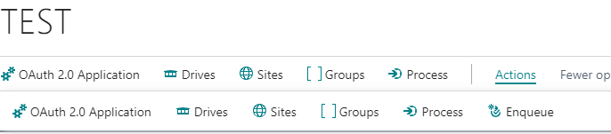

### Error Handling

Files with issues are copied into the Error Directory. 
Additionally a notification is generated for the particular files issue:
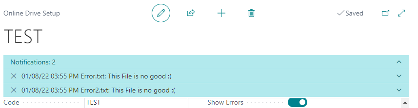

A Error Log can be generated as well. For this tick the _Log Errors_ flag.
You can adjust the Error Log file name.
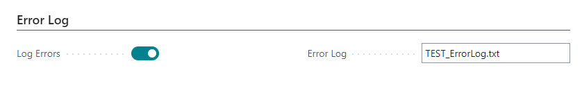

The file will be created and appended in the Error Directory.
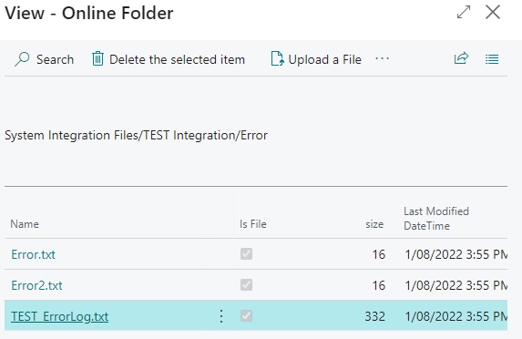